# saan.kim

- Graph Data Analysis
- Deep Learning
- Python
- Golang
- Chemistry
- Bayesian Optimization
- [🪸](https://github.com/saankim/saankim/wiki)

$$\mathcal{G} = \{\mathcal{V}, \mathcal{E}\}$$
<script src="https://polyfill.io/v3/polyfill.min.js?features=es6"></script><script id="MathJax-script" async src="https://cdn.jsdelivr.net/npm/mathjax@3/es5/tex-mml-chtml.js"></script># Bayesian optimization
# 베이지안 최적화
베이지안 최적화는 베이즈 정리를 바탕으로 글로벌 최적화를 위한 Sequential optimization하는 알고리즘이다. 베이지안 최적화를 통해 풀 수 있는 문제를 수식으로 표현하면 $\max_{x \in A} f(x)$ 와 같다. 보통 20차원 이하의 차원에 대해서 잘 동작하며, 이 이상의 차원에 대해서는 Curse of dimensionality를 겪게 된다. 베이지안 최적화 과정에서 차원의 저주는 가우시안 프로세스에서 correlation 계산시 고차원의 점들간의 correlation이 비슷해지는 문제에서 기인한다.


## 알고리즘

1. 아무 function으로 회귀
   앞으로 이 함수를 posterior function이라 부르겠음.
   이 이름은 베이지안 법칙으로 부터 오는 이름.
2. 회귀한 function으로부터, 기대값이 최고인 정의역벡터 $\mathrm{x}$를 구함
3. 해당 정의역벡터를 입력으로 하는 실험을 진행해서, $f_{true}(\mathrm{x}) = \mathrm{y}$ 를 구함
4. $\mathrm{(x, y)}$를 추가해 회귀한 posterior에 대해 반복
	1. 추가해 회귀할때 correlation function과 커널에 따라 이웃한 점들의 posterior를 새 데이터를 prior로 보고 베이지안 법칙에 따라 계산하게 됨.
이 과정에서, posterior function으로 보통 가우시안 프로세스회귀 를 사용한다. 특별히, 가우시안 프로세스 회귀를 surrogate model로 사용한 베이지안 최적화 과정을 Kriging이라고도 한다.


## 일반적인 구현
가장 일반적인 형태의 베이지안 최적화 구현은 가우시안 프로세스에 acquisition function이 추가된 형태를 가지고 있다. 


### Acquisition function
Acquisition function은 베이지안 최적화 과정에 따라 가정된 posterior 함수를 입력받아, 다음 실험을 위한 하나 또는 여러 정의역 벡터 $\mathrm{x}$를 선택하는 함수다. 다른 모든 Optimization 알고리즘과 유사하게, 탐색/최적화 사이의 trade-off 관계에 대해 어떤 목적에 더 중점을 두고 탐색해나갈지에 따라 다양한 acquisition function이 있을 수 있다.
참고로, 아래와 같은 변수들을 조정했을때도 탐색과 최적화 중에 한 쪽에 더 중점을 두도록 모델을 설계할 수 있다.
- Posterior 함수의 분산행렬 $\Sigma$를 생성하는 correlation function의 선정
	- 더 멀리 있는 $\mathrm{x}$도 더 비슷한 correlation을 가지도록 하면 모델이 탐색을 덜 수행하도록 만들 수 있다.
- Posterior 함수의 분산 $\sigma$
	- 분산을 크게 둘 수록 더 많은 지점을 탐색하려는 것 처럼 행동하기 쉽다.
- Posterior 함수의 error 범위
	- 에러 범위를 크게 둘 수록 더 많은 지점을 탐색하면서 최적값을 찾아나가게 된다.

#### 대표적인 acquisition function
- Expected Improvement, EI


## 베이즈 정리와의 연관성
베이지안 최적화 과정을 posterior distribution을 prior $\mathrm{(x,y)}$가 추가됨에 따라 업데이트 해 나가는 과정으로 해석한다면, prior를 통해 posterior를 계산할 수 있는 베이즈 정리로부터 유도될 수 있음을 알 수 있다.
- 베이즈 정리
	- 주어진 값: prior
	- 찾고자 하는 값: posterior
- 베이지안 최적화
	- 주어진 값: 데이터셋
	- 찾고자 하는 값: correlation/kernel function에 따라 결정된 이웃 정의역 $\mathrm{x}$의 posterior


### 무모수 모델인가?
베이즈 정리와의 연관성을 바탕으로 베이지안 최적화를 무모수 모델로 생각할 수 있다. 결론부터 말하자면 베이지안 최적화 과정은 무모수 모델이 맞다. 하지만 베이지안 최적화 과정에서 posterior 함수로 흔히 사용하는 GP regressor는 hierarchy prior를 사용하지 않으면, mean function에서 모수추정을 하고 있기 때문에 베이지안 최적화 모델 전체가 무모수 모델이라 볼 수는 없다.


#### 무모수 모델이 되는 법
더 자유로운 실험값에 대한 optimization을 위해 무모수 모델에 더욱 가깝게 만들 수 있는 방법이 있다.


##### GP에서 hierarchy prior를 사용하는 방법
GP mean function에서 가정하는 모수추정모델을 두지 않을 수 있는 방법이다. Hierarchy prior로 prior를 chainging 한 후 mean function 선정에 관여하는 hyperparameter(mean function polynomial의 계수 등)에 대해 정리하면 mean function과 그 파라미터를 error(robustness) $\epsilon$에 대한 함수로 둘 수 있다.


##### RBF 커널과 중심극한정리를 이용한 방법
Gaussian process 등 posterior function에 Radial basis fuction kernel (RBF kernel)을 적용해주면, Central limit theorem에 따라 모수를 가정하는 모델에 의한 최적화 프로세스의 왜곡을 줄일 수 있다는 해석이 있으나, 이는 여기서 증명하지 않겠다.


## 구현
특히 Machine learning 또는 Neural network모델에서 하이퍼파라미터 최적화를 위해 사용할 수 있다.


# References
- https://towardsdatascience.com/a-conceptual-explanation-of-bayesian-model-based-hyperparameter-optimization-for-machine-learning-b8172278050f
- https://machinelearningmastery.com/bayes-theorem-for-machine-learning/
- P. I. Frazier, “A Tutorial on Bayesian Optimization,” arXiv, arXiv:1807.02811, Jul. 2018. doi: [10.48550/arXiv.1807.02811](https://doi.org/10.48550/arXiv.1807.02811).
- J. Brownlee, “How to Implement Bayesian Optimization from Scratch in Python,” _Machine Learning Mastery_, Oct. 08, 2019. [https://machinelearningmastery.com/what-is-bayesian-optimization/](https://machinelearningmastery.com/what-is-bayesian-optimization/) (accessed Aug. 31, 2022).
- [GpyOpt](https://sheffieldml.github.io/GPyOpt/)# 베이지안 통계학
Bayesian statistics

베이지안 통계학은 베이즈 정리에 따라 사전확률과 사후확률의 관계로 통계적 추론을 수행하는 방법이다.

## 베이즈 정리
둘 이상의 사건에 대한 사전확률과 사후확률간의 관계에 대한 정리
$$\text{posterior} = \frac{\text{likelihood} \times \text{prior}}{\text{evidence}}$$
사후확률은 가능도(=우도)와 사전확률의 곱을 증거확률로 나눈 값이다. 실제 문제에서 ‘증거확률과 우도’와 ‘사전확률’을 동시에 알기 어렵다는 한계가 있었다. 빅데이터와 컴퓨터 기술의 발달로 사건의 확률을 근사할 수 있게 되면서 활용도가 커지고 있다. 특히 후술하는 Sequential optimization 문제를 풀기 위한 배경 이론으로써 베이지안 최적화에 사용된다.

베이즈 정리를 두 사건에 대해 수식으로 표현하면 아래와 같다. 두 사건에 대한 식이 가장 많이 쓰인다.
$$
P(B|A) = \frac{P(A|B) \times P(B)}{P(A)}
$$
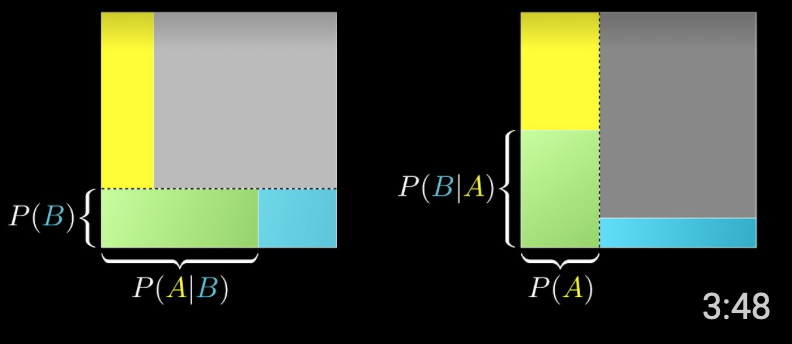

베이즈 정리를 $n$개의사건에 대해 수학적으로 일반화 할 수 있다. 표본공간 $S$를 사건들 $A_1, A_2, ... , A_n$이 분할할 때, 사건 $B \neq \emptyset$ 에 대한 $P(B)$는 $P(B)= \sum_{i}^n P(B\cap A_i)$다(확률의 덧셈정리). 이는 다시 $P(B)= \sum_{i}^n P(A_i)P(B|A_i)$와 같다(확률의 곱셈정리). 이런 상황에서 사건 $B$가 일어나는 것을 전제로 한 사건 $A_i$ 의 조건부 확률은 다음과 같이 구할 수 있다.
$$\displaystyle P(A_i|B)={P(B\cap A_i)\over P(B)}={P(A_i)P(B|A_i)\over {\sum_{i}^n P(A_i)P(B|A_i)}}$$
또는 $P(B) = \sum_{i}^n P(A_i)P(B|A_i)$를 $\int_{A} P(B|A)$로 적을 수 있다.


### 예시
병에 걸린 사람을 A확률로 찾아내는 검사키트가 있다. 양성판정을 받은 사람이 실제로 병에 걸렸을 확률X는? (이때 사람이 이 병에 걸릴 확률은 B다.)


#### 비유적 요약
전체 사람들 중 병에 걸린 사람이 충분히 적다면 양성 환자가 유병일 확률도 작을 수 밖에 없다. 왜냐하면 병에 걸리지 않은 사람이 너무 많아서, 양성 환자 중에서 무병양성(오진) 환자가 유병양성 환자의 수를 압도하기 때문이다. 이 때에는 오진률을 낮추는 것이 양성환자의 유병률을 높이는데 도움이 된다.


#### 수학적 해설
$$P(B|A) = \frac{P(A|B) \times P(B)}{P(A)}$$
- $A$
	= 유병인 사람이 양성일 확률
	= (유병 → 양성) 확률
	= $P(A|B)$
	= 우도 likelihood $\mathcal{L}$
- $B$
	= 어떤 사람이 유병일 확률
	= (사람 → 유병) 확률
	$=P(B)$
	= 사전확률 prior
- 양성인 사람이 유병일 확률
	= (양성 → 유병) 확률
	= $P(B|A)$
	= 사후확률 posterior
- 어떤 사람이 양성일 확률
	= (사람 → 양성) 확률
	= $P(A)$
	= 증거확률 evidence
	= 어떤 사람이 유병이면서 양성일 확률
		+ 어떤 사람이 무병이면서 양성일 확률
	= (유병 → 양성) 확률
		+ (무병 → 양성) 확률 (오진률)


## 기하적 표현
베이즈 정리를 직관적으로 이해할 수 있도록 기하학적으로 표현할 수도 있다. 전체에서 $A$와 $B$의 면적은 서로 수직한 각각의 확률분포에 의해 결정되고, 면적 1의 정사각형 위에 네 개의 확률영역을 형성할 뿐이다.


### 참고 영상
<iframe width="100%" height="100%" src="https://www.youtube.com/embed/U_85TaXbeIo" title="YouTube video player" frameborder="0" allow="accelerometer; autoplay; clipboard-write; encrypted-media; gyroscope; picture-in-picture" allowfullscreen></iframe>
<iframe width="100%" height="100%" src="https://www.youtube.com/embed/HZGCoVF3YvM" title="YouTube video player" frameborder="0" allow="accelerometer; autoplay; clipboard-write; encrypted-media; gyroscope; picture-in-picture" allowfullscreen></iframe>


## Sequential Optimization 관점
Sequential optimization 관점에서, 베이즈 정리는 현재까지의 증거를 바탕으로 다른 사건의 확률을 통계적 추론하는 과정으로 볼 수 있다. 임의의 가정, **prior** $P(B)$에 새로운 사건 $A$를 반영해서 조건부 확률이자 사후확률인 $P(B|A)$를 구하는 것이다.

다음과 같은 Machine learning 알고리즘에서 베이즈 정리가 사용된다.
- Naive Bayesian
- 베이지안 최적화
- Kriging


### 예시
1. 어떤 사람이 유병인지 진단받으러 왔다.
2. 이 사람의 유병률은 $P(B)$다.
3. 그런데 이 사람이 양성판정을 받는 사건 $A$가 일어났다.
4. 이때 이 사람의 유병률은, 사건 $A$에 따라 업데이트된 $P(B|A)$다.
5. 이는 베이즈 정리에 따라 구할 수 있다.


## 고전통계와의 비교
$$Classical Statistics: P(data|model)$$
$$Bayesian Statistics: P(model|data)$$
베이지안 통계학은 추론통계의 두 학파 중 하나다. 추론통계가 미지의 확률에 대해 모집단의 P-value를 통한 검정을 추구하는데 반해, 베이지안 통계학은 사건 발생에 따른 사후확률의 업데이트로 미지의 확률을 구하고자 한다. 곧, 고전 통계학은 과거의 결과에 따라 통계적 가설의 타당성을 검증한다. 베이지안 통계학은 모델의 가능성을 과거의 결과에 따라 계산하여 검정한다.


## 머신러닝 관점
Machine learning 을 문제와 답을 입력으로 받고 해결책을 출력하는 과정으로 일반화한다면, 베이지안통계학의 $P(model|data)$과 연결되는 부분이 있다.


## Bayesian brain: 인지과학, 신경과학 관점
인간의 인지와 심리 또는 신경의 행동이 베이즈 정리에 부합함을 보이는 연구가 있다. 
- https://kilthub.cmu.edu/articles/journal_contribution/Bayesian_models_of_cognition/6613682
- https://www.psy.gla.ac.uk/~martinl/Assets/MCMPS/KnillPouget04.pdf

이 필드에서는 특히 O, observation으로 notation 하는게 특징이다.
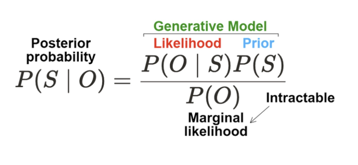
$P(O)$ 는 $p(\mathbf{X} \mid \alpha)=\int_\theta p(\mathbf{X} \mid \theta) p(\theta \mid \alpha) \mathrm{d} \theta$  에 따라서 계산된다. 식의 상징적인 의미는 모든 가능한 경우에 대한 likelihood, 곧 [marginal likelihood](https://en.wikipedia.org/wiki/Marginal_likelihood)다.


### 크롬웰의 법칙 Cromwell's Rule; The zero priors paradox
사전확률 prior를 0 또는 1로 두게 되면, 베이즈 정리에 따라 사후확률도 항상 0이나 1이 된다. 따라서 새로운 증거가 나타나더라도 가설이 업데이트되지 못한다.


## Reference
1. “What is Bayesian statistics?”, NATURE BIOTECHNOLOGY, Vol. 22, No. 9, pp. 1177-1178, 2004
2. “Bayes’ theorem”, NATURE METHODS, Vol. 12, No. 4, pp. 277-278, 2015
3. “Bayesian statistics”, NATURE METHODS, Vol. 12, No. 5, pp. 377-378, 2015
# Five Viewpoints for learning
인공지능과 뇌과학 분야에서 제안되어온 학습 기제에는 크게 아래와 같은 분류들이 있다.
1. Supervised vs. Unsupervised vs. Self-supervised
   지도 vs. 비지도 vs. 자가지도
2. Discriminative(classification) vs. Generative
   구분 vs. 생성
3. Model-free vs. Model-based
   모델이 없는 vs. 모델에 기반한
4. Exploitation(pragmatic) vs. Exploration(epistemic)
   활용 vs. 탐험
5. Nature(inductive bias) vs. Nuture(inference and learning)
   본성(내재된 편향) vs. 양육(추론과 학습)
   

## Supervised vs. Unsupervised vs. Self-supervised
뇌가 학습을 하는 과정에서 각각의 경우에 대해 explicit reward(negative errror)가 바로 주어지지는 않는다. 따라서 뇌의 학습기제는 비지도학습에 가까울 것이라는게 현재의 컨센서스다. 다만, 현대 들어서는 self-supervised 방식일 것으로 기대하는 접근들도 많다.


## Discriminative(classification) vs. Generative
- Discriminative 모델은 boundary를 학습해서 입력 데이터를 분류한다.
- Gernerative 모델은 internal representation을 학습해서 목적하는 분포와 유사하게 분포된 데이터를 생성

수식으로 쓰자면 각각 아래 확률을 학습한다. 데이터를 $X$, 라벨을 $Y$로 표현했다.
- Discriminative $P(Y \mid X=x)$
- Generative $P(X, Y)$
	- Conditional generative $P(X \mid Y = y)$

[Computational Cognitive Neuro Science 2021 conference](https://www.youtube.com/watch?v=bEG4T18le5g&ab_channel=CognitiveComputationalNeuroscience)에서 이 논의가 진행되었다.


## Model-free vs. Model-based
강화학습 관점에서, 환경의 transition을 직접 예측할 수 있는 방법을 가지고 있으면 model-based로 볼 수 있다. 특히 RL관점에서는 아래 그림처럼 분류할 수 있다. 주의할 점은 policy는 model이 아니라는 점이다. policy가 아니라 환경에 대한 simulative model을 가지고 있느냐로 구분해야 한다.
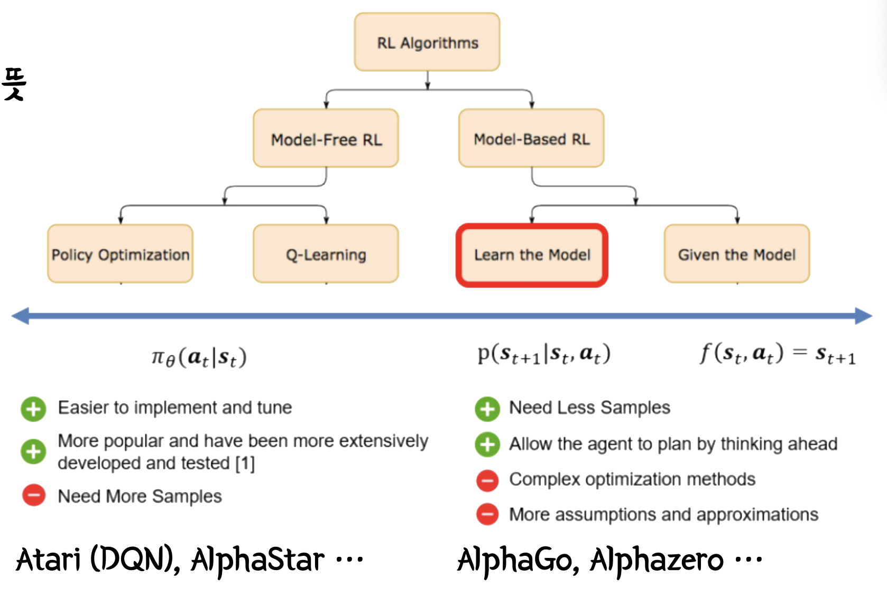


## Exploitation(pragmatic) vs. Exploration(epistemic)
활용만 한다면 새로운 정보를 얻고 더 큰 reward가 기대되는 행동을 개발하기 어렵다. 반면 탐험을 하면 더 탐험성 높은 탐색을 위해 reward를 어느정도 포기하는 결정을 해야한다. 지능은 이 둘을 적절히 종류하면서 reward를 최대화하고자 한다.


## Nature(inductive bias) vs. Nuture(inference and learning)
뇌과학 분야에서는 피아제의 발달 5단계를 비롯한 개념들로 연구되어 왔다. 인공지능 분야에서는 inductive bias라는 표현이 흔히 사용된다.

참고자료
- [Building Machines That Learn and Think Like People](https://arxiv.org/pdf/1604.00289.pdf)
- [Towards developmental AI](https://www.youtube.com/watch?v=s9EeozO6fp8)


# Reference
- https://www.youtube.com/watch?v=vLfHhjxeXrY
- https://www.youtube.com/watch?v=bEG4T18le5g&ab_channel=CognitiveComputationalNeuroscience


# Gaussian process
가우시안 프로세스

# Gaussian process 이론
가우시안 프로세스는 입력 값과 출력 값 분포의 gaussian한 무작위성을 고려한 확률분포 생성 프로세스다. 확률론의 배경이 있기 때문에 이를 확률분포 생성 모델로 보지만, Machine learning 측면에서 이를 Regression모델로 볼 수 도 있다.

 


## 설명
다변량 정규분포는 아래와 같이 쓸 수 있다. 평균 $\mu$의 벡터와 분산 $\Sigma$의 행렬로 표현한 것이다.

$$p(x, y) \sim \mathcal{N}\left(\left[\begin{array}{l}\mu_x \\ \mu_y\end{array}\right],\left[\begin{array}{c}\Sigma_x \Sigma_{x y} \\ \Sigma_{x y}^T \Sigma_y\end{array}\right]\right)$$

가우시안 프로세스는 mean function $m(t)$와 커널-covariance matrix를 생성하기 위한-의 조합으로 표현할 수 있다.


# 구현


# References
- https://greeksharifa.github.io/bayesian_statistics/2020/07/12/Gaussian-Process/
- https://github.com/ShuaiGuo16/Gaussian-Process/blob/master/GP_cheatsheet.pdf# 근대 인공지능의 역사
History of modern
현대 인공지능 모델이 나타나기까지 인공지능 연구의 역사에서 다뤄왔던 모델들을 주제와 시간에 따라 다뤄보자.


# 주제별 역사
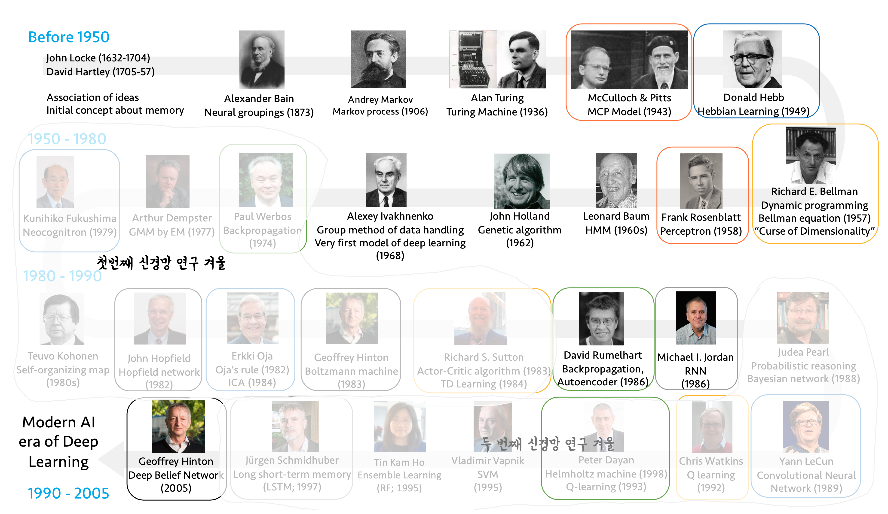
- 같은 주제의식을 공유하는 연구는 같은 색 테두리로 표현되어 있다.
- 첫 번째 겨울
	러닝 알고리즘의 부족. 신경망에 적절한 가중치를 부여하기 어려웠다.
- 두 번째 겨울
	하드웨어 계산속도의 부족. 필요한 가중치 계산을 충분한 시간 내에 하기 어려웠다.
주제: 신경과학 도메인에서의 시각


## 신경모델
- MCP Model (McCulloch & Pitts, 1943)
- Perceptron (Frank Rosenblatt, 1958)


## Plasticity
- Hebbian learning (Donald Hebb, 1949)
- Oja's rule (Erkki Oja, 1984)


## 강화학습: action
강화학습을 이용한 접근방식
- Dynamic programming (Richard E. Bellman, 1957)
	- Bellman equation
		- 차원의 저주
- Actor-critic algorithm (Richard S. Sutton, 1983)
	- TD learning (1984)
- Q learning (Chris Watkins, 1992)


## 생성모델: internal representation
- Back propagation (Paul Werbos, 1974)
- Back propagation, Autoencoder (David Rumelhart, Geoffrey Hinton, 1986)
- Helmholtz machine (Peter Dayan, 1998)
	- Q-Learning (1993)


## 시각체계
- Neocognitron (Kunihiko Fukushima, 1979)
- Convolutional Neural Network (Yann LeCun, 1989)


## 비-순전파 신경망: cognition 
Feed forward(순전파)하지 않는 신경망
- Hopfield network (John Hopfield, 1982)
- Boltzmann machine (Geoffrey Hinton, 1983)
- Deep Belief Network (Geoffrey Hinton, 2005)


## 순차적 데이터: temporal domain
Sequential Data에 대해 다루는 인공지능 분야
- Recurrent neural network (Michael I, Jodan, 1986)
- Long short-term memory (Jürgen Schmidhuber, 1997)


# 시간순 역사
- 시간 순서로 주요 연구를 아래 정리하였다.


## 극초기
- Initial concept of memory (John Locke, 1632-1704) (David Hartley, 1705-1757)
- Neural groupings (Alexander Bain, 1873)
- Markov process (Andrey Markov, 1906)
- Turing Machine, Turing test (Alan Turing, 1936)


## 1943 | MCP Model
(McCulloch & Pitts, 1943) 신경 모델을 전자적으로 구현.
퍼셉트론 문서에서 더 자세히 설명.


## 1949 | Hebbian learning
(Donald Hebb, 1949) Learning algorithm을 제시하고, 신경망을 학습시킴.
인공신경망 학습 알고리즘 문서에서 더 자세히 설명


## 1958 | Perceptron의 등장
(Frank Rosenblatt, 1958) 퍼셉트론 문서에서 또한 자세하게 설명. 역사적 의의 중 하나는 인공지능 모델과 달리 Sigmoid 함수를 이용해서 step function 보다 나은 Nonlinearity를 추가했다는 점이다.


## 1962 | Genetic algorithm
(John Holland, 1962) 유전 알고리즘으로 최적 전략을 찾아내는 연구. 신경망을 사용하지 않는 접근이다.
Genetic algorithm


## 1968 | Group method of data handling
(Alexey Ivakhnenko, 1968) Deep learning과 유사한 최초의 시도.
$$Y(x_{1}, \dots , x_{n}) = a_{0} + \sum\limits_{i=1}^{m}a_{i}f_{i}$$
$$
\begin{align}
Y\left(x_1, \ldots, x_n\right)=
&\begin{aligned}
a_{0}
\end{aligned} \\
&\begin{aligned}
+\sum_{i=1}^{n} a_i x_i
\end{aligned} \\
&\begin{aligned}
+\sum_{i=1}^n \sum_{j=i}^n a_{i j} x_i x_j
\end{aligned} \\
&\begin{aligned}
+\sum_{i=1}^n \sum_{j=i}^n \sum_{k=j}^n a_{i j k} x_i x_j x_k+\cdots
\end{aligned}
\end{align}
$$
- Output $Y$를 elementary function $f_{i}$의 가중합으로 표현
- Elementary function은 input variable의 모든 가능한 선형곱의 가중합


## 첫 번째 겨울
다음에 나오는 backpropagation이 연구되기 전까지, 학습(가중치 업데이트) 알고리즘의 부재로 인한 첫 번째 인공지능 연구의 겨울이 있었다.


## 1974 | Backpropagation
(Paul Werbos, 1974) Back propagation 항목에서 설명. Werbos는 박사학위논문에서 dynamic feedback 이라는 이름으로 BP 개념을 제시한 바 있다. Geoffrey Hinton이 BP 개념을 만든 것으로 널리 알려져 있기 때문에 [논쟁](https://www.reddit.com/r/MachineLearning/comments/g5ali0/d_schmidhuber_critique_of_honda_prize_for_dr/)이 있다. 


## 1979| Neocognitron
(Fukushima, 1979) 신경과학 관점에서는 영장류 시각체계 초기 모델. 후에 Convolutional Neural Network가 LeCun에 의해서 제시될 때, Fukushima의 연구를 알고 있지는 않았다. 하지만 MLP를 이용한 feature extraction의 개념은 이 때 이미 제시되어 있었다.


## 1982 | Hopfield network
(John Hopfield, 1982)
Hopfield network 문서에서 더 자세한 내용을 소개하고 있다.


## 1983 | Boltzmann machine
(Geoffrey Hinton, 1983) Hopfield network와 같은 Energy minimization 관점을 공유함.
Boltzmann machine


## 1983 | Actor-critic algorithm
(Richard S. Sutton, 1983) 강화학습의 본격적인 시작. 강화학습의 기초가 되는 수식과 프로세스다. 다음의 프로세스에서 reward는 environment와 return 시점에 의존한다(=내재적 uncertainty). 언제 reward가 주어질지, reward를 높이는 방향으로 policy를 업데이트한다는 것은 어떤 의미인지를 알기 어렵기 때문에 RL을 이용해 현실의 문제를 풀기 어려워지는 문제가 있다.
 1. Cycle:
	 1. State
	 2. Action
	 3. Reward (Return, Value, Q-function으로 개념이 고도화됨)
		 1. Policy update


## 1984 | 강화학습: TD learning
Bellman Equation
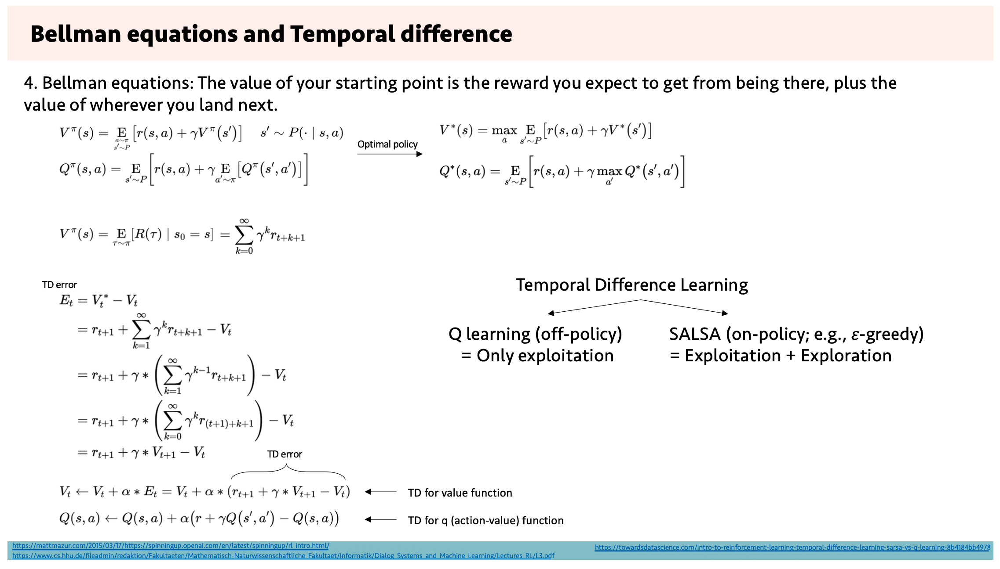
- Neuro Science 분야에서 reward에 대해서 다룰때 TD-error에 대한 개념을 많이 다룬다.
- 이후 저서: Reinforcement Learning. An introduction
- Q-learning
- Optimal Control Theory


## 1986 | Auto Encoder
(David Rumelhart, 1986)
- Internal representation(≈ encoding)

**AutoEncoder는 Generative 모델인가?**
Deterministic encoder기 때문에, 오토인코더는 당연히 input과 유사한 output을 생성한다. 때문에 (사람이 인식하기에) 새로운 데이터를 생성할 수 있는 generative 모델이라 불릴 수 있는 수준을 달성하지는 못했다. 하지만 후에 Deep belief network(Hinton G, 2006)을 보면 DBN을 확률론적 autoencoder 로써 묘사하고 있다. 따라서 generative 모델의 초기 시도로 볼 수 있겠다. Generative model 분야에서는 후에 variational autoencoder 또한 등장하는데, 이 모델 또한 확률분포를 이용해 생성모델을 구현하고 있다.
그렇지만, DBN류의 확률분포를 이용하는 생성모델이 널리 사용되고 있지 못한데, 학습이 잘 안 되기 때문이다. 학습이 잘 안되는 이유는 확률론적 모델로써 sampling layer가 필수적인데, 이 sampling 과정이 computationally heavy하기 쉽기 때문이다.

**신경과학 관점에서 ==Helmhotlz machine==과의 비교**
Autoencoder를 절반으로 접어놓은 것과 같은 형태. encoder와 decoder가 같은 weight를 공유한다고 볼 수도 있겠다. 홍석준 교수님께서 말씀하시기로는, 감각을 인코딩하고, 예상을 디코딩하는 형태로 뇌에 구현되어있지 않을까 생각하게 된다는데, 왜냐하면 같은 weight를 공유하는 형태가 connection 관점에서는 encoding 방향과 decoding 방향 양쪽 모두로 connection이 있는 형태기 때문이다. 이는 신경과학 관점에서 predictive coding이라 불리는 개념이다.


## 1986 | Recurrent neural network
(Michael I. Jordan, 1986)
Recurrent neural network


## 1988 | Probabilistic reasoning과 Bayesian network
(Judea Pearl, 1988)


## 1989 | Convolutional neural network
(Yahn LeCun, 1989)
Convolutional Neural Network

**Neocognitron과의 차이점**
Neocognitron은 잘 동작하는 시각모델의 시초로써, WTA(Winner Takes it All)이라는 자체적인 알고리즘을 학습과정에서 사용하였다. 이 알고리즘을 통해 Neocognitron은 unsupervised learning과 일면 유사성 있는 학습을 할 수 있었지만, 잘 학습되지는 않았다. 이후 CNN이 학습성능과 사용성능 모두 좋은 모습을 보여주면서 CNN이 시각모델의 기초로 여겨지고 있다.


## 두 번째 겨울
컴퓨팅 파워의 부족으로 인한 신경망 연구의 겨울 시기 동안 shallow level의 알고리즘들이 많이 연구되었다.
- Q-learning (Peter Dayan, 1993)
- Support vector machine (Vladimir Vapnik, 1995)
- Extream gradient boosting
이후 DBN이 나오면서 현대적 NN모델과 연구들이 등장하게 된다.


# References
- https://www.youtube.com/embed/RBx0s-uqEh0
- https://www.youtube.com/embed/OMbg87Xyf2U
# Hyperbolic GCNN
Hyperbolic Graph Convolutional Neural Networks
- NeurIPS 2019
- 302 Citations in Google Scholar
- 저자
  - Stanford University
  - cs224w 강의를 진행하는 등 network 관련 연구실


## Overview
쌍곡면을 커널로 사용하는 Graph neural network.

노드들의 feature vector를 쌍곡면 위에 플롯한다. 쌍곡면과 한 점에서 접하는 평면-하이퍼볼릭탄젠트 공간-위에 플롯된 feature 벡터들을 사영한다. 이를 통해 가까운 노드들의 feature 분포를 확대하고 먼 노드들의 feature 분포를 축소하는 효과를 낼 수 있다. 게다가 하이퍼볼릭탄젠트 평면은 평면이기 때문에 feature aggregation을 위한 algebraic operation들이 정의되고 수행될 수 있다. 하이퍼볼릭탄젠트 공간에서 node feature aggregation 결과로 생성된 node feature를 다시 하이퍼볼릭 공간에 사영한다. 여기서 proposition을 통해 하이퍼볼릭 탄젠트 공간과 하이퍼볼릭 공간이 작은 범위에서 정보손실 없이 사영될 수 있음을 확인한다. 이는 결과적으로 하이퍼볼릭 공간 위에서 featrue aggregation을 수행한 것과 같은 결과를 내고자 함이다. 추가로, hyperbolic space ↔︎ hyperbolic tangent space의 계산은 hyperbolic trigonometric function의 일종이자, exporential & logaric function으로 표현될 수 있기 때문에 미분특성이 좋다.

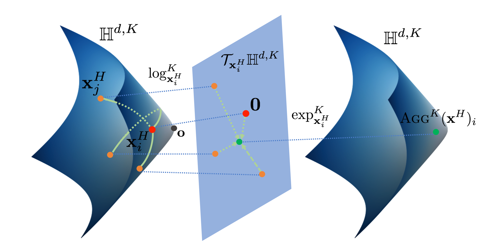
- $\mathbb{H}^{d, K}$
	왼쪽과 오른쪽의 쌍곡면. $d$차원의 쌍곡면 공간
- $\mathcal{T}_{\mathbf{x}} \mathbb{H}^{d, K}$
	평면. $d$차원의 하이퍼볼릭 탄젠트 공간
- $\textrm x_j^H$
	주황 점. feature vector of a node
- $0$
	빨간 점. 왜곡이 최소가 되는 탄젠트 공간과 하이퍼볼릭 공간의 접점
- $\operatorname{AGG}^{K}(\mathbf{x}^{H})_{i}$
	초록 점. aggregation된 feature vector
- $\log$와 $\exp$
	hyperbolic space ↔︎ hyperbolic tangent space 간의 전환을 수행하는 커널 함수


### Problem setting
유클리디언 공간 $\rm E$(↔︎ 하이퍼볼릭 공간 $\rm H$)에 있는 $d$ 차원의 노드 특성이 $0$ 번째 레이어에 입력으로 들어갈 때, 아래와 같이 표현할 수 있다.

$$(\rm x^{0,E} \it \_i )_{i \in \mathcal{V}}$$
$$f:\left(\mathcal{V}, \mathcal{E},\left(\mathbf{x}_{i}^{0, E}\right)_{i \in \mathcal{V}} \right) \rightarrow Z \in \mathbb{R}^{|\mathcal{V}| \times d^{\prime}}$$

본 논문에서는 Graph neural network를 개선시키기 위해 더 나은 임베딩함수 $f$를 만든다. 임베딩함수는 노드, 에지, 이웃한 노드의 feature vector $\left(\mathcal{V}, \mathcal{E},\left(\mathbf{x}_{i}^{0, E}\right)_{i \in \mathcal{V}} \right)$를 feature vector의 집합 $Z$로 변환한다. 모든 feature vector가 이웃한 노드의 모든 feature vector를 가지고 있다면, $Z$의 차원은 feature vectore의 차원이 $d$일때 $|\mathcal{V}| \times d$ 차원이다. 임베딩 함수 $f$의 목적은 $|\mathcal{V}| \times d$보다 작은 $|\mathcal{V}| \times d^{\prime}$ 차원에 feature vector를 임베딩하는 것이다.


## Background

### GCNN과 비교
Graph Convolutional Neural Network에서는 feature representation $h$를 $h=W \rm x + b$ 꼴의 linear transform의 연속으로 생성한다. 이후 neighborhood aggregation(convolution analogy)를 통해 feature vector $\mathbf{x}_i^{\ell, E}$ 를 생성한다.

- Feature transform
$$
\mathbf{h}_{i}^{\ell, E}=W^{\ell} \mathbf{x}
_i^{\ell-1, E}+\mathbf{b}^{\ell}
$$
- Neighborhood aggregation
$$
\mathbf{x}_i^{\ell, E}=\sigma\left(\mathbf{h}_i^{\ell, E}+\sum_{j \in \mathcal{N}(i)} w_{i j} \mathbf{h}_{j}^{\ell, E}\right)
$$


### 기하 관점
Hyperbolic geometry is a non-Euclidean geometry with a constant negative curvature $c$. Here, we work with the hyperboloid model for its simplicity and its numerical stability.
- 원
	$x^2 + y^2 = r^2$
- 쌍곡선
	$-x^2+y^2 = c$


### Hyperbolic 이면
$$
\mathbb{H}^{d, K}:=\left\{\mathbf{x} \in \mathbb{R}^{d+1}:\langle\mathbf{x}, \mathbf{x}\rangle_{\mathcal{L}}=-K, x_0>0\right\}
$$

$$
\mathcal{T}_{\mathbf{x}} \mathbb{H}^{d, K}:=\left\{\mathbf{v} \in \mathbb{R}^{d+1}:\langle\mathbf{v}, \mathbf{x}\rangle_{\mathcal{L}}=0\right\}
$$
- $\mathbb{H}^{d, K}$ has negative curvature $-1/K$
    - Minkowski inner product
		$<\mathbf{x}, \mathbf{y}>_\mathcal{L} := -x_0y_0 + x_1y_1 + \dots + x_dy_d$
		dot product의 변형으로, 음의 곡률을 만들기 위해 한 가지 축 방향으로 음의 dot product 항이 있다.
- Euclidean tangent space at point $\rm x$
	- tangent space ≡ set of orthogonal vectors
- $\rm v, w$는 아래 식을 만족하는 리만 메트릭 텐서 $\in$  리만 곡면
$$
\mathcal{T}_{\mathbf{x}} \mathbb{H}^{d, K}, g_{\mathbf{x}}^{K}(\mathbf{v}, 
\mathbf{w}):=\langle\mathbf{v}, 
\mathbf{w}\rangle_{\mathcal{L}}
$$

- 리만곡면은 국소적으로 복소평면과 동형
	- 따라서 국소적으로는 Euclidean 연산 가능
		⇒ 전체 공간에서는 유클리드 연산이 정의되지 않기 때문에 유용


### Geodesics and induced distances
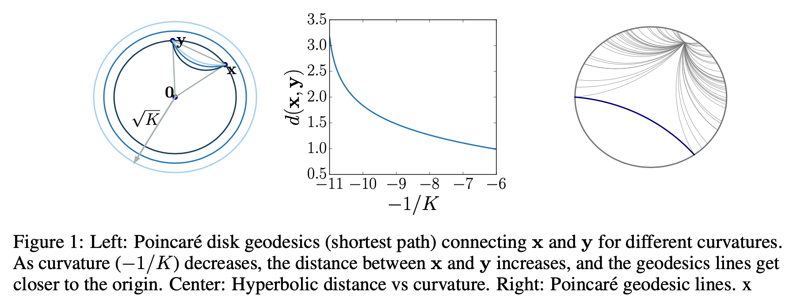
- 첫 번째 그림
	Tangent space 를 2차원에 사영하면 Poincaré disk와 같다
- 두 번째 그림
	곡률이 커지면 두 점 사이의 거리가 늘어난다
- 세 번째 그림
    - 회색 선 hyperbolic parallel lines…

이 그림과 유클리드 평면을 생각하면서,
- Geodesics and distance functions are particularly important in graph embedding algorithms, as a common optimization objective is to minimize geodesic distances between connected nodes.


### Proposition
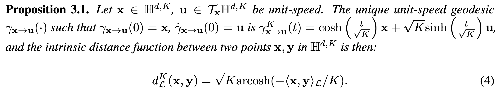
- 하이퍼볼릭 공간 H위의 한 점 x
- x를 포함하는 탄젠트 공간 TH 위의 한 벡터 u를 unit-speed  라고 하자
- unique unit-speed 를 가지는 geodesic 𝛾 가 있다
    - 𝛾는 x가 원점
    - 𝛾는 t에 대한 𝛾 위의 한 벡터의 미분이 u다
- 이때 𝛾 는 선형 t 공간을 K에 의존하는 cosh, sinh로 변형한 공간이다
- 따라서 H 위의 두 점의 거리는 K에 의존하는 arccosh(TH norm)의 식으로 나타낼 수 있다
    - $\mathcal L$은 TH위의 노름을 의미


### 이 수식의 의미는,
TH를 잘 정의하면, H의 거리를 쉽게 구할 수 있다 (특히, 미분이 쉬운 형태로)
	⇒ 일종의 커널


### Exporential and logarithmic maps
H와 TH 사이의 매핑을 위한 추가 커널.
- $\rm exp^K_x(v) := \gamma(1)$을 이용
- In general Riemannian manifolds, these operations are only defined locally but in the hyperbolic space, they form a bijection between the hyperbolic space and the tangent space at a point.
    - 구면에서는 원을 돌아 오면 계속 같은 점이 반복되지만, 쌍곡면에서는 그렇지 않은 성질을 이용

결과적으로는 아래 수식을 얻을 수 있다.
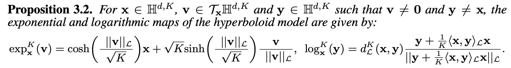


## Method
1. Mapping from Euclidean to hyperbolic spaces
	Hyperbolic distance 이용
	$\mathbf{x}^{0, H}=\exp _{\mathbf{o}}^{K}\left(\left(0, \mathbf{x}^{0, E}\right)\right)=\left(\sqrt{K} \cosh \left(\frac{\left\|\mathbf{x}^{0, E}\right\|_{2}}{\sqrt{K}}\right), \sqrt{K} \sinh \left(\frac{\left\|\mathbf{x}^{0, E}\right\|_{2}}{\sqrt{K}}\right) \frac{\mathbf{x}^{0, E}}{\left\|\mathbf{x}^{0, E}\right\|_{2}}\right)$
2. Feature transform in hyperbolic space
    Hyperboloid linear transform 이용
	$W \otimes^{K} \mathbf{x}^{H}:=\exp_{\mathbf{o}}^{K}\left(W \log_{\mathbf{o}}^{K}\left(\mathbf{x}^{H}\right)\right)$
	$\mathbf{x}^{H} \oplus^{K} \mathbf{b}:=\exp_{\mathbf{x}^{\mathbf{H}}}^{K}\left(P_{\mathbf{o} \rightarrow \mathbf{x}^{H}}^{K}(\mathbf{b})\right)$
3. Neighborhood aggregation on the hyperboloid manifold  
	Attention based aggregation 이용
	$w_{i j}=\operatorname{SOFTMAX}_{j \in \mathcal{N}(i)}\left(\operatorname{MLP}\left(\log _{\mathbf{o}}^{K}\left(\mathbf{x}_{i}^{H}\right) \| \log _{\mathbf{o}}^{K}\left(\mathbf{x}_{j}^{H}\right)\right)\right)$
	$\operatorname{AGG}^{K}\left(\mathbf{x}^{H}\right)_{i}=\exp _{\mathbf{x}_{i}^{H}}^{K}\left(\sum_{j \in \mathcal{N}(i)} w_{i j} \log _{\mathbf{x}_{i}^{H}}^{K}\left(\mathbf{x}_{j}^{H}\right)\right)$
	- i, j 에 대해
	- log로 tangent space로 옮겨서 linear transform을 정당화하고
	- || 로 concat 하고
	- MLP로 임베딩하는 과정을
	- 모든 이웃에 대해 수행하고서
	- SOFTMAX 한다
	⇒ 결과로 나온 w를
		- exp 에 넣어서 다시 H위로 옮긴다


### Non-linear activation with different curvatures
$$\sigma^{\otimes^{K_{\ell-1}, K_{\ell}}}\left(\mathbf{x}^{H}\right)=\exp _{\mathbf{o}}^{K_{\ell}}\left(\sigma\left(\log _{\mathbf{o}}^{K_{\ell-1}}\left(\mathbf{x}^{H}\right)\right)\right)$$
- $K_l$ 로 적절한 K를 learnable
- 𝜎 로 non-linear
- log, exp 를 거치며 커널로 공간 변환


## Experiments
여러 데이터셋에 대해 아래 네 가지를 비교하였으며
- 보통 NN
- 주변만 보는 GNN
- 더 큰 주변을 Euclidean 하게 보는 GNN
- HGCN
	최적 $\rm K$ 를 찾기 위한 탐색도 진행하였다.


## Results
community structure 가 분명한 곳에서 기존보다 더 뛰어난 성능을 보여줌
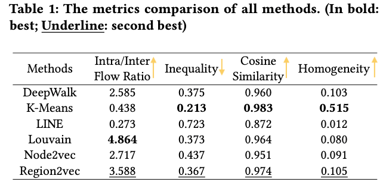


## Conclusion
# 라그랑주 역학
Lagrangian mechanics

라그랑주 역학은 물리량 라그랑지언을 이용하는 역학이다. Lagrange (1788)

라그랑주 역학은 뉴턴 역학Newton Machanics과 같은 시스템을 기술하지만, 같은 운동을 바라보는 다른 해석을 제시한다. 해밀턴의 법칙-"자연은 항상 액션이 최소화되는 것을 좋아한다. "-이나 그 현대적 확장 Least Action Principle에 따라, 초기 상태와 최후 상태를 정의하고 그 사이의 운동을 액션을 최소화되도록 계산하는 것이 라그랑주 역학의 핵심이다.


## 라그랑지언
고전역학에서 계의 라그랑지언$L$은 계의 운동에너지$T$와 퍼텐셜에너지$U$의 차로 정의된다.
$$L \equiv T - U$$
한 입자의 모든 상태는 아래와 같이 정의된다. 시점 $t$에서의 위치 $q(t)$와 속도 $\dot{q}(t)$
$$L = L\{q_i(t), \dot{q}_i(t); t\}$$


## 액션
라그랑지언의 시간 적분을 액션이라 부른다.
$$S \equiv \int_{t_{1}}^{t_{2}}L\{q_{i}(t),\, \dot{q}_{i}(t) ; \, t \}\,dt$$
다음과 같이 쓸 수도 있다.
$$S=\int L \; d^{n}x$$
$$S=\int L \; dw_{n}$$


## 해밀턴의 원리
액션$S$를 최소화하는 경로로 운동이 일어난다는 원리
$$\displaystyle \delta S=\delta \int_{t_{1}}^{t_{2}} L\,dt=0 $$


## 오일러-라그랑주 방정식
오일러 방정식을 통해 위 미분을 풀 수 있다.


## 의미

### 양자역학 Quantum mechanics
양자역학 실험에서는 모든 양자상태를 실시간으로 관측하기 어렵다. 왜냐하면 관측은 양자계와 관측자 사이의 정보교환을 요구하는데, 이 정보교환에는 필연적으로 입자, 파동 또는 에너지의 전달이 필요하다. 때문에 관측이 관찰하고자 했던 양자상태를 교란한다. 따라서 최초 양자상태와 최후 양자상태 그리고 계의 특성만으로 운동을 기술할 필요가 있으며, 이에 라그랑주 역학이 활용된다.


# 해밀턴 역학
라그랑지언의 르장드르 변환된 꼴이 해밀토니언이라고 할 수 있다.


# 해밀토니언(양자역학)


# 르장드르 변환
Legendre transformation 

여러 독립변수로 표현되는 양을 다른 변수로 표현하기 위한 해석적 변환

함수 $y=f(x)$ 위의 임의의 점$x$에서 접선을 그었을 때의 기울기를 $f_x$,  y절편을 $\psi$라 하면 아래와 같다.
$$\displaystyle  f_x= {y-\psi \over x-0}$$
이를 $\psi$에 관한 식으로 고치면 아래와 같다.
$$\displaystyle  \psi=y- f_x x$$
이때 $\psi$를 $y$의 ${dy \over dx}$ 에 대한 르장드르 변환이라고 한다. $\psi=y[f_x]$로도 나타낸다. 곧 $x, y$에 관한 식 $f(x)$를 $\psi$와 $f_x$의 식으로 표현한 것이다. 여기서 두 변수의 집합은 서로 완전히 동등하게 대응된다.


## 의미

### 기하적 직관
$d$ 차원에서 어떤 물리량이 $f(x) = y$ 꼴로 정의된다고 하자. $\int_{x_i}^{x_j} f(x) dx$ 로 $f(x)$ 와 $x$축 사이의 부피를 정의하면, $f(x)$와 $y$축 사이의 부피도 정의된다. 이때 두 부피 간의 변환이 르장드르 변환이다.# Likelihood
가능도, 우도; 주어진 관측값과 가설의 조합이 그럴싸한 정도

확률분포 $p$가 주어졌을 때, 어떤 사건 $x$의 확률(확률)은 $p(x)$로 구할 수 있다. 그렇다면, 사건 $x$가 주어졌을 때, 이 사건을 설명할 수 있는 확률분포가 $P_{1}$일 가능성(가능도)은 얼마일까?

확률과 가능성이라는 비슷한 두 단어가 동시에 쓰여서 헷갈린다. 예시로 우리에게 익숙한 주사위에서 시작해보자.
- 6면체 주사위에서 1의 눈이 나올 확률은 $\frac{1}{6}$
- 12면체 주사위에서 1의 눈이 나올 확률은 $\frac{1}{12}$

그렇다면 주사위 눈이 1이 나왔을 때, 던졌던 주사위가
- 6면체일 확률은 $\frac{1}{6}$
- 12면체일 확률은 $\frac{1}{12}$
라고 말할 수 있다.


## 형식화
수식을 통해 위 예시를 형식화해보자.
- 기호
	- 예시에서 있었던 표현
	- 의미
- $p_{\text{six}}$
	- 6면체 주사위
	- 확률분포. 어떤 사건들(주사위의 눈)과 그 확률을 담고 있다.
- $p_{\text{six}}(x=1)$
	- 1의 눈이 나올 확률
	- 어떤 사건에 대한 확률
- $L(p_{\text{six}}; x=1)$
	- 1의 눈이 나왔을때, 던진 주사위가 6면체 주사위일 가능성
	- 가능도

> [!Question] 왜 가능도를 $p(x=1\mid p_{\text{six}})$로 적지 않고 새로운 기호를 만들었을까?
> 모든 사건들에 대한 확률의 총합은 항상 1 이다. $\sum_{x} p = 1$
> 그러나 $\sum L \neq 1$ 일 수 있기 때문에. 넓은 의미에서 $L$은 확률이 아니다.


## 확률과 가능도의 비교
확률과 가능도의 차이를 알았으니, 전체 개념을 비교해보자.
- 모수들 $\theta$
- 확률분포 $p$
- 가능도 $L$
- 관측값 $X$

하나의 모수집합 $\theta$ 가 하나의 확률분포 $p$를 결정할 때 다음과 같이 말할 수 있다.
확률분포는 사건의 확률을 구하는 함수. 곧 임의의 사건을 $[0,1]$로 매핑하는 함수.
$$
p: x \rightarrow p
$$
가능도함수는 사건에 대한 확률분포의 가능도를 구하는 함수.
$$
L: X, p_{𝜃a} \rightarrow L
$$
가능도값을 실제로 구하거나 사용할 때는, 가능도의 파라미터가 되는 확률분포함수 $p_{\theta}(x)$의 값을 사용하게 된다. 곧, 가능도는 사건을 x축으로 하고, 확률을 y축으로 하는 확률밀도함수에서 y값, 확률과 같은 값을 사용하게 된다. 따라서 실용적으로는 가능도를 곧 다음과 같이 구하겠다.
$$
L = p(x=\text{obserbed})
$$


## 베이지안 통계학에서
베이지안 통계학에서 likelihood는 사후사건이 있을 때, 사전확률분포의 가능도다. 이때는 더 좁은 의미로 쓰여, 사전사건에 대한 사후사건의 조건부 확률로 다른 확률과 같은 차원에 있다.

두 사건에 대한 베이지안 통계학에서는, 두 번째 사건(보통 사후확률로 찾고자 하는 사건)이 일어났을때 사전확률이 일어날 확률을 의미한다. 예를 들어, 병을 가지고 있다는 것과 양성판정의 예시에서는 병을 앓고 있는 사람이 양성판정을 받을 확률이다.


# Marginal likelihood
ML을 공부하다보면 marginal likelihood를 표현하는 항이나, 최적화하는 대상으로 삼는 내용을 많이 만날 수 있다. 여기서 이 표현까지 이해해보자.


## Marginalization
marginalized out, integrated out

마지널라이즈는 결국 수식에서 (인간이) 집중하고 싶은 부분에 맞춰 식을 정리했다는 뜻이다. 이때 관심있는 항 외의 다른 모든 항들을 적분하게 된다. 그래서 integrated out 표현이 수식과 더 직접 이어진다고 하겠다.
$$
p(x \mid y)=\int_Z p(x, z \mid y) d z
$$
위 식에서는 $p(x, z \mid y)$로 표현되는 $x, z$의 확률 $p$를 $x$와 $y$에 대한 식으로 만들기 위해 우리가 관심 없는 항인 $z$를 $\int  \, dz$를 이용해 제거하고 있다.


# Maximum Likelihood Estimator와 머신러닝
MLE, 최대 우도 추정

## 관측값이 많을 때 가능도함수의 정의와 log likelihood
확률변수 $X$와 같은 확률밀도함수와 분포를 따라 관측된 $x_1, \cdots, x_n$ 이 있다고 하자. 확률밀도함수는 $\theta$ 를 모수로 가지고 $p(\theta;x)$로 쓰자. 모든 관측값을 가장 잘 설명하는 확률밀도함수를 찾기 위한 우도함수를 어떻게 정의해야 할까? 가장 간단한 정의로 각각의 관측$x$에 대한 가능도$L$을 모두 곱한 값을 생각할 수 있다.
$$
L(\theta ; x):=\prod_{k=1}^n p\left(x_k ; \theta\right)
$$
우리의 주된 관심사는 $L$을 최대화하는 $\hat{\theta}$를 찾는 것이다.
$$
\hat{\theta}= \underset{\theta}{\arg \max } L(\theta ; \mathbf{X})
$$
$\arg \max$에 영향을 주지 않고, 양변에 $\log$를 씌워서 곱연산을 덧셈연산으로 만들어 계산을 편하게 할 수 있다.
$$
\log L(\theta ; \mathbf{x}):=\sum_{k=1}^n \log p\left(x_k ; \theta\right)
$$


## 머신러닝에서
주어진 데이터에 잘 맞는 모델을 만들고 싶어하는 ML 관점에서 살펴보자. ML에서 만들고자 하는 모델이 결국 $p_{\theta}()$ 함수라고 할때 데이터를 잘 설명하는 $\theta$ 가 필요하다. 가능도가 어떤 데이터를 주어진 확률분포로 설명할 수 있는 정도라고 할 때 결국 최적의 $\theta$를 찾는 문제와 이어진다. 곧, 머신러닝 문제에서 마지널 가능도를 최적화 한다는 의미는 $L$을 $\theta$에 대한 식으로 표현한 뒤 $L$을 최대화하는 모델의 파라미터 $\theta$를 찾는 것과 같다.

여기서부터는 $\hat{\theta}$를 구하기 위해 최적화 방법이 사용된다. 가장 간단한 예시는 $L(\theta)$가 미분가능할 때, 미분값이 $0$이 되는 지점을 찾는 것이다. 이를 편미분방정식으로 적고 estimating equation이라 부르기도 한다. $\frac{\partial l(\theta)}{\partial \theta}=0$


## Log marginal likelihood
특히 Gaussina random process에 대해 log marginal likelihood라는 표현이 자주 쓰인다. 이는 위에서 설명한 마지널가능도에 계산의 편의를 위해 log를 씌운 것이다.


# References
- https://m.blog.naver.com/sw4r/221380395720
- https://www.cs.ubc.ca/~nando/540b-2011/lectures/l9.pdf
- https://freshrimpsushi.github.io/categories/수리통계학/
- https://freshrimpsushi.github.io/posts/optimizer-argmax-and-argmin/# Modern AI in the Perspective of Computational Neuroscience
Perception: convolution of receptive fields
- AlexNet
- GoogleNet
- VGGNet
- ResNet
- Mask-RCNN
- YOLO

Time: sequence modeling
- RNN
- LSTM
- GRU

Attention: key-query-value
- Seq2Seq
- Transformer
	- GPT2
	- BERT

Generative: latent representation
- VAE
- GAN
- Flow-based

Active-Value: RL
- DQN
- A3C
- World model
- Dreamer

Relation: graph
- CGNN
- RGNN
- GAE
- GNN-RL


Contrasive: prediction in the latent space
- Contrasive Predictive Coding(CPC)


# ResNet
Residual connection(skip connection)으로 gradient descent 문제를 일부 해결해서 깊은 NN을 만들 수 있었다.
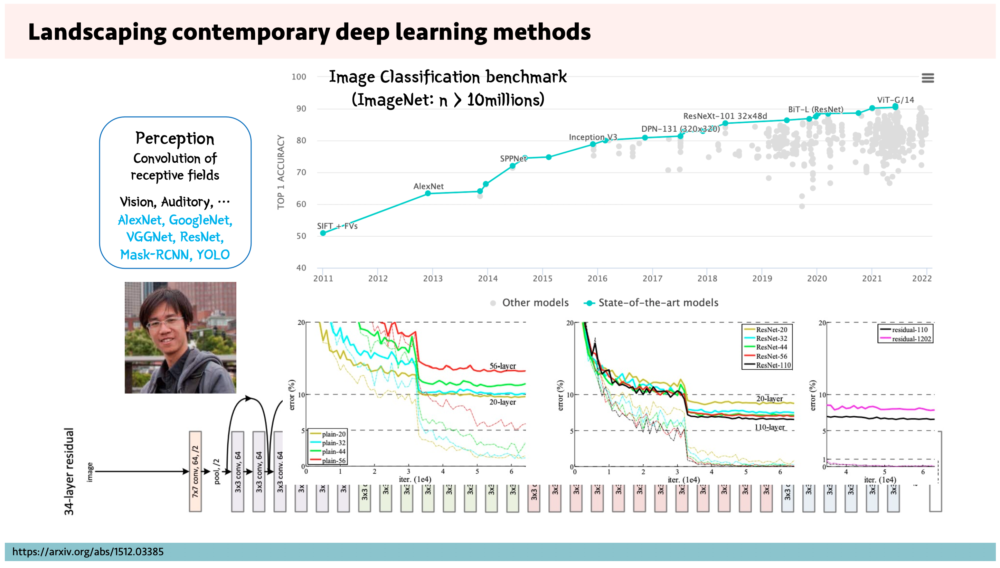

# CNN
Spatial inductive bias를 가지고 있는 convolution filter를 이용해서 image recognition 분야에서 성능을 끌어올릴 수 있었다.


## Mask RCNN
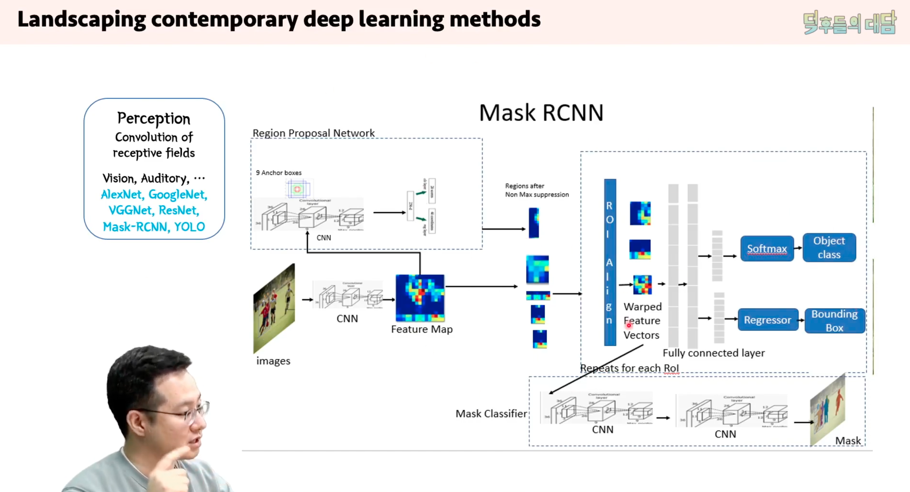
CNN을 거쳐서 나올 feature map에 mask를 씌워서 segmentation.


Task의 hierarchy에 따라 분류한 vision 모델의 종류
- Image recognition
- Semantic segmentation
- Object detection
- Instance segmentation

# Self-attention mechanism

Word2Vec

ViT: Vision Transformer

Generative models
variational autoencoder
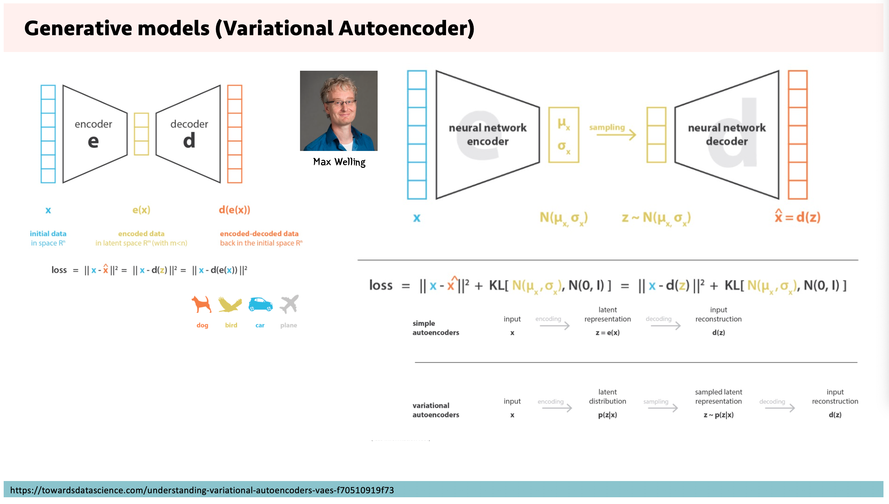
- 본래의 분포를 따르기: 원래의 오토인코더
- 그런데 각각의 분포가 가우시안 분포하면 좋겠어
	- 이 덕분에 representation이 latent space 위에서 랜덤하게 퍼져있는게 아니라, 가우시안하지만 최소한의 overlap만 가지도록 해서 빽빽하게 채워지게 된다.
	- 이걸 probabilistic modeling이라고 부른다
이러한 접근방식이 헬름홀츠 머신에서 제시된 적 있다.
인코더 디코더의 나비넥타이 구조를 겹쳐둔게 헬름홀츠 머신이기 때문이다.
- 헬름홀츠 머신은 weight를 공유하지만 오토인코더는 인코더-디코더가 weight를 공유하지는 않는다.

GAN은, 비슷한 구조를 가진다.
그런데 input으로 노이즈 Z를 주고, 이거에서 fake x를 뽑는데, 이 fake x를 discriminator가 real fake 구분하기 어렵게 자꾸 학습한다. 
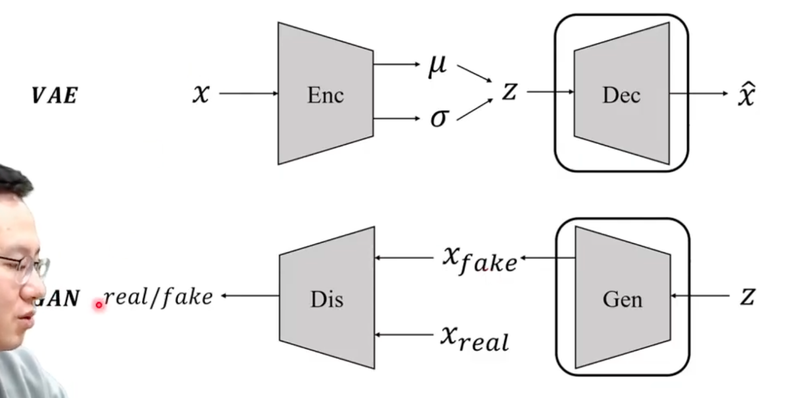


Dreamer2
simulative 한 이해를 가질 수 있도록 학습


GNN
tranductive learning으로 인과관계를 인코딩 가능


Contrastive learning
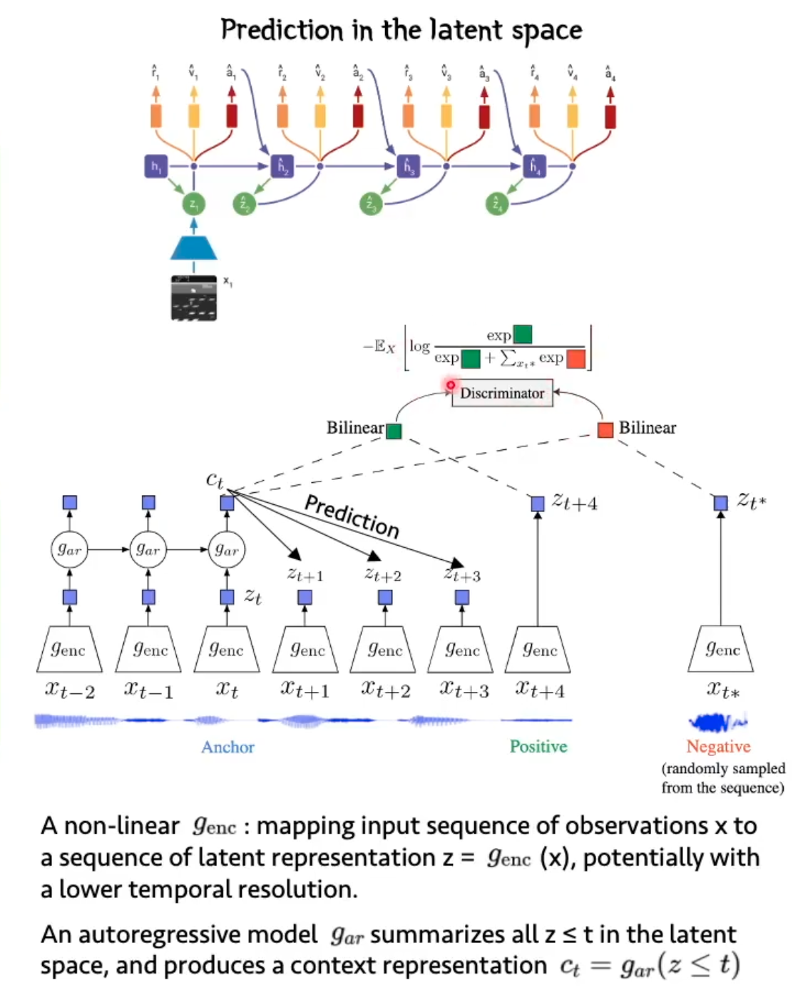


총정리
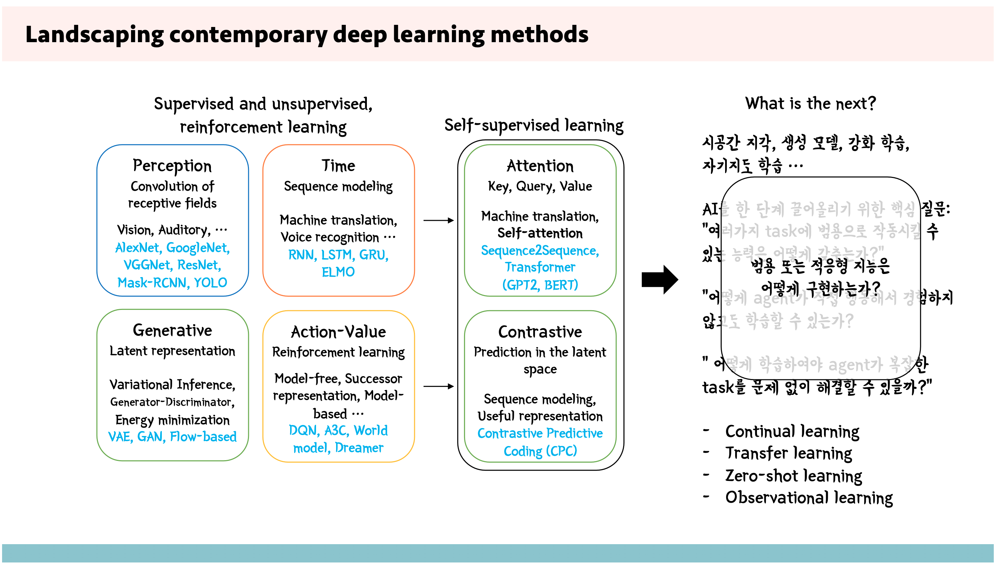


missing
1) Epistemic and Pragmatic value를 어떻게 정의하고, 이 두 가지 value processing component를 탑재한 agent를 어떻게 구현할 것인가?
-   -  Epistemic value: 세상으로부터 얻을 수 있는 유의미한 지식 à (pseudo) 인과 관계
-   -  Pragmatic value: Agent의 궁극적인 목표 설정 (energy efficiency?)à외재적, 내재적 가치 형성

    2) Model-free와 Model-based system을 spectrum을 어떤 식으로 구현할 것인가?
-   -  Internal generative model: p(st+1|st) distribution을 어떻게 학습할 것인가? Latent space에서의 prediction을 구현하는 가장 유용한 방법은 무엇일까?
-   -  Habitual system(model-free)은 어떤 기제를 바탕으로 만들 것인가?
-   -  두 가지 큰 predictive representation, reward prediction과 state prediction error를 계산하는 기제는 어떤 식으로 구현할 것인가?
    
    3) 내·외부 환경 변수 representation, 즉 외부 세상의 상태 (external state)를 나타내는 변수와 agent의 내부 상태 (internal state)을 어떤 식으로 개념화해야 할까?
-   -  Attractor를 가지고 있는 state space에서의 oscillation?
-   -  Hierarchical structure를 가지고 있는 state variables들?
    
    4) 평생 학습 (Life-long learning)을 하기 위한 기제를 어떻게 구현할 것인가?
-   -  Latent representation을 어떻게 형성시켜야 각기 다른 학습을 서로 간섭하지 않게 만들 수 있을까?
-   -  Curriculum learning의 가장 좋은 전략은 무엇인가?


# References
- https://www.youtube.com/watch?v=VWIfhuMxBS4# Intro
순전파하지 않는 신경망; Hopfield network부터 Boltzman machine까지


# 홉필드 네트워크
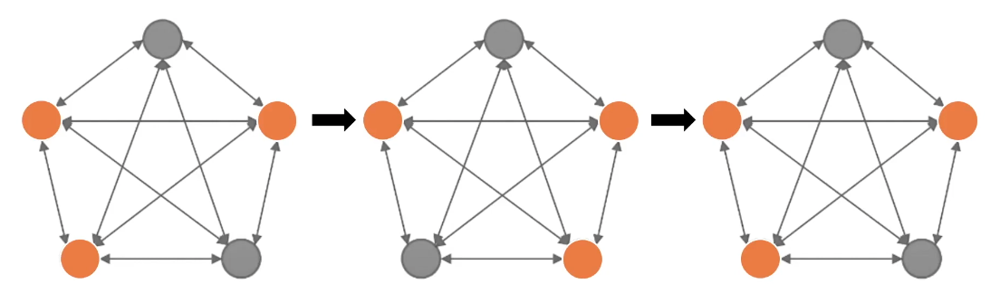
1. Perceptron neuron은 $\pm 1$의 출력을 갖는다.
2. Fully connected Graph로 뉴런들이 연결되어 있다.
3. 뉴런간 Weight는 symmetric 하다.
결과적으로 신호를 주고받는 뉴런들은 flipping한다.

Hopfield의 연구에 따르면, flipping은 weight 변화를 거쳐 결국 어떤 패턴으로 optimize 된다.
- 에너지 관점
	flipping이 많이 일어나는 상태를 에너지가 높은 상태, flipping이 적게 일어나는 상태를 에너지가 낮은 상태로 보고 안정화되는 현상으로 해석할 수 있다.
- 기억 관점
	network가 한 번 안정화 되고 나면, 새로운 input이 주어지더라도 얼마간의 filipping을 거쳐 다시 안정한 상태를 회복하게 된다. 이를 weight에 의한 패턴의 기억이라고 해석할 수 있다. 뉴런 숫자에 따라서 표현할 수 있는 최종 패턴의 복잡도와 종류가 수학적으로 결정된다. 그리고 새로운 입력값은 어떤 최종 패턴 중 하나로 수렴한다.


## 기하적 직관
위 두 관점을 아우르는 시각화는 다음과 같다. 각각의 minimun이 하나하나의 기억이라고 해석할 수 있겠다.
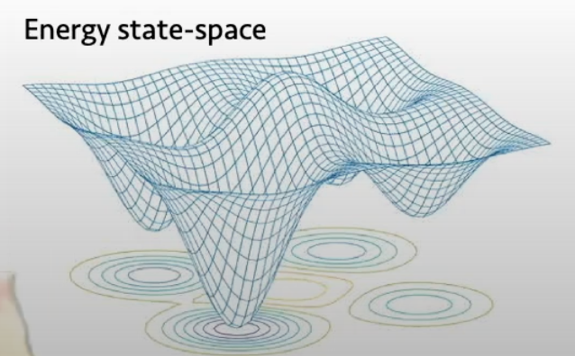


## 신경과학 관점
아주 근접한 작은 minimun 두 개 중 하나를 지우거나, 충분히 깊은 minimum 하나를 강화하는 방향으로 뇌가 작용하는 결과가 꿈 이라는 해석이자 가설이 있다.


## 이후 연구
- Boltzmann machine (Geoffrey Hinton, 1983)
	에너지 최소화 기반 모델로 Hopfield network와 같은 관점을 공유한다.
- Hopfield Networks is All You Need
  홉필드 네트워크에서 뉴런의 활성화도로 $\pm 1$ 만을 사용하지 않고 continuous한 값을 사용하게 되면 기억 가능한 값의 지점이 exporential 하게 증가하는 현상에 대한 연구
- Attention, Attention is All You Need
  Hopefiled 네트워크와 attetion의 식이 구조적으로 같다.
- 당시 energy 기반 모델이 주목받은 이유는 Ising model과 같이, molecule들의 dipole이 field에 의해 flip 되는지를 복잡계적으로 접근한 연구들의 영향이 있다. 영상 55분 45초 경.


# 볼츠만 머신


# References
- John Hopfield, 1982# Perceptron and MLP
퍼셉트론(Frank Rosenblatt, 1957)은 가장 초기 단계의 인공신경망 모델 중 하나다. 퍼셉트론은 Supervised learning을 통해 Binary classification 문제를 풀 수 있다.


# 퍼셉트론
우리가 인공지능을 통해 풀고 싶은 문제를 $n$개의 입력값을 보고 판단해 적절한 출력을 제시하는 문제로 일반화 해 보자. 입력 $\mathrm{x}_i$에 대해, 적절한 가중치 $\mathrm{w}_{i}$를 각각 곱해서 더해주면 우리가 원하는 출력 $\sum_{i}^{n}\mathrm{w}_{i}\mathrm{x}_{i}$을 만들 수 있을 것이다. 이는 단순한 가중합으로, 예를 들어 서류 20% 실기 80%으로 하여 실기에 4배 큰 $w_{i}$를 곱해 합한 점수로 선수를 선발하는 과정과 유사하다.

이 모델이 더 복잡한 문제를 풀 수 있도록 신경과학에서 밝혀진 신경의 구조를 응용하자. 신경은 들어온 입력의 크기가 충분한 크기에 도달할 때 까지는 반응하지 않다가, 어느 크기(역치)이상의 입력이 들어왔을 때만 출력을 내보낸다. 이 과정을 응용해 인공 뉴런을 만들어 보자.

역치 $\theta$ 이상의 입력 $\sum_{i}^{n}\mathrm{w}_{i}\mathrm{x}_{i}$이 주어졌을때 1, 아닐 때 0을 출력하는 계단 함수(step function)는 인공 뉴런의 행동을 잘 묘사한다. 계단함수는 가장 간단한 활성화 함수 중 하나다.
$$
y =
\begin{cases}
    1 & \text{if } \sum_{i}^{n}\mathrm{w}_{i}\mathrm{x}_{i} \geq \theta \\
    0              & \text{otherwise}
\end{cases}
$$

식을 간단하게 만들고 이후의 다른 딥러닝 문서에서 흔히 사용하는 꼴로 바꾼다 계단 함수 식에서 역치 $\theta$를 부호를 바꿔 편향 $\mathrm{b}$으로 표시하고, if-otherwise를 같은 과정을 수행하는 함수 $\sigma(x)$로 쓸 수 있다. 또한 $\sum_{i}^{n}\mathrm{w}_{i}\mathrm{x}_{i}$ 가중치벡터 $\mathrm{w}$의 전치 $\mathrm{w^T}$와 입력벡터 $\mathrm{x}$의 dot product로 표시한다. 아래 식에는 표시했지만, 때로는 Transpose전치를 의미하는 $T$를 생략하기도 한다.
$$
y = \mathrm{\sigma(w^{T}\cdot x+b)}
$$

이 퍼셉트론을 단층 퍼셉트론이라고 한다. $x$를 입력층 $y$를 출력층으로 부르는 한 층의 퍼셉트론이다.


## 학습 알고리즘
1. 가중치 초기화
2. $n$개의 데이터를 가진 Training set $D$에 포함된 입력과 적절한 출력의 순서쌍 $(\mathrm{x}_{j}, d_{j})$ 마다, $t$ 시점에서,
	1. 출력을 계산하고
		$y_{j, t} = \mathrm{w^{T}}_{j, t} \mathrm{x}_{j} + \mathrm{b}_{j, t}$
	2. 에러(= error = loss = cost)를 얻고
		$\delta = d_{j} - y_{j,t}$
	3. 가중치와 bias를 Optimization에 따라 업데이트한다. $\eta$는 학습률(learning rate)다. 아래 식에서는 $w$만 묘사하였다. bias 업데이트의 더 자세한 내용은 Back propagation 문서에서 볼 수 있다.
		$w_{i, t+1} = w_{i, t} + \eta \cdot \delta$

위 과정을 도식화하면 아래와 같다


# Multi-layer perceptron(MLP) 다층 퍼셉트론 
MLP는 단층 퍼셉트론을 여러 층 쌓은 인공신경망 모델이다. Feed forward neural network의 가장 단순한 형태로 볼 수 있다. 단층 퍼셉트론을 여러 층 쌓여있을때 입력층과 출력층 사이의 층을 은닉층(hidden layer)라 부른다. 이렇게 층이 많아졌을때의 인공신경망 모델을 Deep learning이라 부른다.


## 학습 알고리즘
MLP의 학습 알고리즘은 단층 퍼셉트론보다 조금 더 복잡하다. 역전파에서 이를 설명한다.


## 퍼셉트론과 논리 게이트
단층 퍼셉트론으로 논리 게이트 연산 중 AND, NAND, OR은 구현할 수 있다. 하지만 XOR 게이트를 구현하기 위해서는 다층 퍼셉트론이 필요하다. (사실 이는 XOR게이트를 AND, OR, NOT게이트의 조합으로 구현하는 것과 연결되는 부분이 있다.) XOR 게이트를 구현하기 위해서는 여러 층의 퍼셉트론을 쌓아야한다. 참고로 $\sigma$가 $\theta=0$인 계단함수일때, 각 논리게이트를 구현할 수 있는 퍼셉트론 가중치의 예시는 다음과 같다.

| GATE | $w_{1}$ | $w_{2}$ | $b$  |
| ---- | ------- | ------- | ---- |
| AND  | 0.5     | 0.5     | -0.9 |
| NAND | -0.5    | -0.5    | 0.9  |
| OR     | 1        | 1        | -0.1     |


### 기하적 직관: 선형 분리
논리 게이트를 구현하는 입력 두 개의 단층 퍼셉트론을 $(x_{1},x_{2},y)$ 공간 위의 $w_{1}x_{1}+w_{2}x_{2}+b=0$ 평면으로 볼 수 있다. 이때 평면은 전체 공간을 두 공간으로 나눈다. 나눠진 두 평면은 각각 $\sigma$함수에 따라 $y =\begin{cases}1 \\0 \end{cases}$로 매핑되며 이것이 곧 논리 게이트의 기하적 표현이다. 이를 $(x_{1},x_{2})$평면 위에 나타내면 다음과 같다.
- AND, OR, NAND
	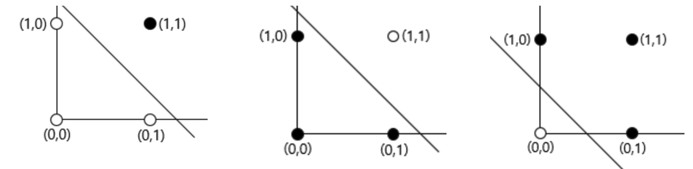
- XOR
polynomial kernel 을 이용하면 퍼셉트론이 XOR 문제를 풀 수 있게 만들 수도 있다.


# 퍼셉트론, 그 이후: SVM
퍼셉트론은 다음 그림과 같은 두 결정경계와 그 사이의 무한하고 연속한 결정경계중에 최선의 경계를 찾을 수 없다-퍼셉트론에게는 그 모든 결정경계가 동등하다. 이 문제를 해결하기 위한 연구는 Support vector machine으로 이어진다.
[](https://en.wikipedia.org/wiki/File:Perceptron_cant_choose.svg)


# 당시 논문: MCP Model
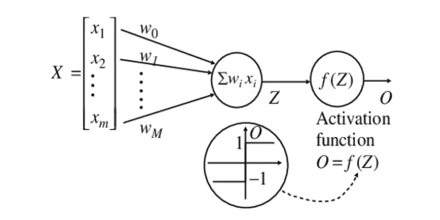
Neuro Science 에서 Integrate-and-fire model(Lapicque L, 1907)을 수식과 모델로 만든 것과도 같다.
재 

### 신경과학 관점: Integrate-and-fire 모델
Integrate-and-fire 모델은 현대까지도 Leaky-integrate-and-fire 모델로 신경이 자극에 어떻게 반응하는지에 대한 유효한 설명으로 쓰이고 있다.
$$O=\left\{\begin{array}{l}
1, \sum_i w_i x_i \geq \theta \quad \mathrm{AND} \quad z_j=0, \forall j \\
0, \text { otherwise }
\end{array}\right.$$

# Reference
- McCulloch & Pitts, 1943
- https://wikidocs.net/24958
- https://en.m.wikipedia.org/wiki/Perceptron
- https://www.baeldung.com/cs/deep-learning-bias-backpropagation
- http://page.mi.fu-berlin.de/rojas/neural/chapter/K7.pdf# code bundel hierarchy
1. `framework: library + supporting objects`
2. `library: package + module`
3. `package.directory`
4. `module.py`
5. `def function():`
6. `class Class: def method():

# match-case
`Python 3.10` 부터 사용할 수 있다. 타 언어의 switch-case 문법과 유사하다.
```python
def http_status(status):
    match status:
        case 400:
            return "Bad request"
        case 401 | 403:
            return "Unauthorized"
        case 404:
            return "Not found"
        case _:
            return "Other error"
```

리스트나 튜플로 인자를 동시에 처리할 수 있는 강력함이 있다.
```python
def greeting(message):
    match message:
        case ["hello"]:
            print("Hello!")
        case ["hello", name]:
            print(f"Hello {name}!")
        case ["hello", *names]:
            for name in names:
                print(f"Hello {name}!")
        case _:
            print("nothing")


greeting(["hello"])
greeting(["hello", "John"])
greeting(["hello", "John", "Doe", "MAC"])
```

```Python
for n in range(1, 101):
	match (n % 3, n % 5):
		case (0, 0): print("FizzBuzz")
		case (0, _): print("Fizz")
		case (_, 0): print("Buzz")
		case _: print(n)
```


# :=
바다코끼리 연산자, Walrus operator, Assignment expression

`Python 3.8` 부터 사용할 수 있다. 표현식에 이름을 부여해 재사용할 수 있도록 만들어준다.

아래와 같이 작성하면 `len()`을 두 번 호출하는 문제를 막을 수 있었다.
```Python
a = [1, 2, 3, 4]
n = len(a)
if n > 5: print(f"List is too long ({n} elements, expected <= 5)")
```

이제는 다음과 같이 한 줄에서 처리할 수 있다.
```Python
a = [1, 2, 3, 4]
if (n := len(a)) > 5: print(f"List is too long ({n} elements, expected <= 5)")
```

아래와 같은 혼동을 피하기 위해 괄호로 감싸줄 필요가 있다.
```Python
n := len(a) > 5
```


## 예시
```Python
while chunk := file.read(128):
	process(chunk)
```

```Python
[y := f(x), y**2, y**3]
```


# with
[PEP 343](https://peps.python.org/pep-0343/)

자원을 획득하고 자동으로 반환해야할 때 사용하면 좋다.
```Python
with EXPRESSION [as VARIABLE]:
	BLOCK

with open(f) as file:
	file.do()

# 실행되는 내용
file = open(f).__enter__(self)
file.do()
file.exit__(self, type, value, traceback)
```


# asyncio
# Qiskit으로 시작하는 양자머신러닝
양자 머신러닝에는 알고리즘/데이터가 각각 양자/고전인지에 따라 네 가지 유형이 있다. 
- 알고리즘/데이터
	- CC
		고전 데이터를 고전 연산으로 처리
		QML의 측면에서는, [Ewin Tang. 2019](https://dl.acm.org/doi/10.1145/3313276.3316310) 와 같이 양자에서 영감을 받은 알고리즘을 사용한다. 
	- QC
		고전 데이터를 양자 알고리즘으로 처리
		QML의 주요 관심 분야
		아래 두 가지 하드웨어에 기반한 알고리즘이 연구되고 있다.
		- qRAM
			양자 메모리를 이용해 중첩된 데이터에 다항시간에 접근하는 기술을 바탕으로 한 알고리즘.
			현재 qRAM을 구현할 수 있는 하드웨어 후보는 없다.
		- Quantum computing
			양자 컴퓨터에 기반한 알고리즘.
			**이 문서에서 주로 집중할 분야**
	- CQ
		양자 데이터를 고전 알고리즘으로 처리
		양자컴퓨팅을 구현하는데 있어 필요하다.
		- Characterisation([Usman, 2020](https://www.nature.com/articles/s41524-020-0282-0))
		- Control([Niu, 2019](https://www.nature.com/articles/s41534-019-0141-3))
		- Discriminating([Magesan, 2015](https://journals.aps.org/prl/abstract/10.1103/PhysRevLett.114.200501))
	- QQ
		양자 데이터를 양자 알고리즘으로 처리
		아직 초기 연구 단계


## Parameterized Quantum Circit
Parameterized Quantum circuit을 통해서 QML 알고리즘을 구현하는 회로를 만들 수 있다.


### Notation
- Parameterized Quantum Circit
- Ansatzes
- $\ket{\phi_\theta} = \mathbf{U}_\theta \ket{\phi_0}$
	아래에 위 수식에 대한 설명이 있다.


### 가장 단순한 형태
- 매개 변수 게이트 두 개
- 같은 파라미터를 가진
	- 단일 큐비트 회전 게이트 한 개
	- 제어-회전 게이트 한 개
```python
from qiskit.circuit import QuantumCircuit, Parameter
theta = Parameter('θ')

qc = QuantumCircuit(2)
qc.rz(theta, 0)
qc.crz(theta, 0, 1)
qc.draw()
```
- 위 회로를 두 개의 다른 파라미터를 가지도록 수정
```python
from qiskit.circuit import ParameterVector
theta_list = ParameterVector('θ', length=2)

qc = QuantumCircuit(2)
qc.rz(theta_list[0], 0)
qc.crz(theta_list[1], 0, 1)
qc.draw()
```

양자 회로에 사용되는 모든 양자 게이트는 Unitary 연산자$\mathbf{U}_\theta$다. 곧, parameterized quantum circit은 어떤 초기상태 $\ket{\phi_0}$의 Qbit $n$개에 대한 unitary operation으로 볼 수 있다. 따라서 $\theta$가 tunable parameter의 집합일 때, parameterized quantum circit은 다음과 같은 수식으로 나타낼 수 있다. 덧붙이자면, 보통 초기 상태는 $\ket{0}^{\otimes n}$로 설정된다.
$$\ket{\phi_\theta} = \mathbf{U}_\theta \ket{\phi_0}$$


### Parameterized quantum circuit properties
Machine learning을 위해 사용하기 위해서는 Quantum circuit이 생성하는 output Quantum state의 집합이 데이터의 해석을 위한 의미있는 집합이어야 한다. 이때 양자회로가 Qbit의 Quantum entanglement를 포함하고 있다면 고전 컴퓨터로 모사하기가 어려워진다.
[Sukin Sim, 2019](https://learn.qiskit.org/course/machine-learning/parameterized-quantum-circuits)에서 quantum circit을 expressibility와 entangling capability에 따라 분류하였다.


#### Expressibility

#### Entangling capability

#### Hardware efficiency


## Reference
- ["Quantum Machine Learning," Qiskit, 2022](https://qiskit.org/learn/course/machine-learning-course)
# Random process
Stochastic process, 확률과정, 확률변수의 수열, 확률변수의 집합

이름이 어려운데, 어려운 개념은 아니다. 예시를 통해 직관적 이해부터 시작해보자.
- 주사위를 던져보자.
- 계속 던지면서, 매번 무슨 수가 나오는지 기록해두자.
- 축하한다! 당신은 방금 확률과정을 수행했다!

곧, 확률과정은 어떠한 확률분포를 따르는 사건이 시간적으로 연속해 발생한 것을 가리키는 말이다.


## 수학적 형식화
수학적 형식화를 조금 추가해 좀 더 엄밀한 정의와 이해를 도모해보자. 확률분포를 따르는 사건은 확률변수라고 부르자. 결국 확률과정은 어떤(주로 시간이나 시행) 변수를 입력받아 관측된 확률변수의 값을 출력하는 함수와 같다. 이제 연속적 확률과정과 이산적 확률과정을 수학적으로 형식화하면 아래와 같다.

- 확률변수 $X$
- 이산적 확률과정 $\{X_n \mid n=0,1,2, \cdots\}$
	- 확률변수의 수열과 같다
- 연속적 확률과정 $\{X_t \mid t \in[0, \infty)\}$


> 함수와 수열
> 수열은 정의역이 자연수인 함수다.


## 예시 코드: 브라운 운동
아래는 가장 흔하게 사용되는 확률과정의 예시인 브라운 운동을 표현하는 파이썬 코드다.

```Python
class Brownian():  
	def __init__(self,x0=0):  
		assert (type(x0)==float or type(x0)==int or x0 is None), 'error'
		self.x0 = float(x0)  
  
	def gen_random_walk(self,n_step=100):  
		w = np.ones(n_step)*self.x0
		for i in range(1,n_step):   
			yi = np.random.choice([1,-1])  
			w[i] = w[i-1]+(yi/np.sqrt(n_step))  
		return w  
  
	def gen_normal(self,n_step=100):  
		# 결과물이 표준분포를 따르도록 유도
		w = np.ones(n_step)*self.x0  
		for i in range(1,n_step):  
			yi = np.random.normal()  
			w[i] = w[i-1]+(yi/np.sqrt(n_step))  
		return w
```


# References
- https://freshrimpsushi.github.io/posts/stochastic-process/
- https://towardsdatascience.com/brownian-motion-with-python-9083ebc46ff0# Region2Vec
Community Detection on Spatial Networks Using Graph Embedding with Node Attributes and Spatial Interactions

- [Github](https://github.com/GeoDS/Region2vec)
- [Journal](https://research.com/conference/sigspatial-2021-acm-sigspatial-international-conference-on-advances-in-geographic-information-systems)
	- IF 4.62
	- H5-index 25


## 1. Purpose
GCN으로 geometric dataset에서 community detection 문제를 풀자.


### 1.1. GNN
- Message passing
	- Aggregation
	- Update

$$
h_u^{(k+1)}=\operatorname{UPDATE}^{(k)}\left(h_u^{(k)}, A G G R E G A T E^{(k)}\left(\left\{h_v^{(k)}, \forall\ v \in \mathcal{N}(u)\right\}\right)\right)
$$

- GCN
	- Convolutinoal layer
	- Node $\mathcal{N}$ ⇒ vector $\mathbb{R}^n$projection
		- Supervised learning with labeled dataset
		- Learning node feature embedding


### 1.2. Community detection
- Clustering
	- Unsupervised learning
	- Optimizing attribute-similarity and spatial interaction trade-off


## 2. Methodology
### 2.1. Notation
- $G=(V, E)$
- $\boldsymbol{A}=\left[a_{i j}\right]_{n \times n}$
- $S=\left[s_{i j}\right]_{n \times n}$
	- spatial interaction matrix
	- $s_{ij}$: flow intensity between $v_{i}$ and $v_{j}$
- $K$ commmnuities with label $c_{1\dots K}$


### 2.2. Dataset
- SafeGraph business venue database
	- 일종의 상권 데이터베이스
		- Point of interest(상권)을 node
		- 사이의 통행로를 edge
		- 통행량과 방향을 제공하는 directed graph dataset
- TIGER/Line Shapefiles
	- Region의 경계
	- Rook-type contiguity relationship: sharing borders → edges
- U.S. Census American Community Survey
	- poverty population
	- race/ethnicity
	- household income


### 2.3. Algorithm
클러스터링 목표
1. 비슷한 속성을 공유할 것
2. 지역들이 긴밀히 연계되어 있을 것
3. 지역들이 서로 이어져 있을 것


#### 2.3.1. Stage One: GCN
2-layer GCN에서 각 레이어의 forward propagation은 아래와 같이 쓸 수 있다.
$$
Z^{(1)}=\operatorname{ReLU}\left(\tilde{D}^{-\frac{1}{2}} \tilde{A} \tilde{D}^{-\frac{1}{2}} X W_0\right) ; Z^{(2)}=\tilde{D}^{-\frac{1}{2}} \tilde{A} \tilde{D}^{-\frac{1}{2}} Z^{(1)} W_1
$$
- Degree matrix인 $D$는 node feature에 대한 일종의 normalization term으로 사용된다.

여기서, GCN은 self-supervised model이지 community detection을 위한 모델이 아니기 때문에  아래 요소들을 조합한 가중치를 error로 제시해줘야 community detection을 위한 학습을 일으킬 수 있다.
- spatial interaction
- flow strength
각각의 interaction이 강할수록 positive pair로 취급. latent space에서 embedding을 가까워지게 했다.

추가로, spatial contiguity를 확보하기 위해 negative node pair가 지리적으로 가까울 때 거리에 비례하는 threshold를 embedding vector의 거리에 준다.
- geographic distance

$$
L_{\text {hops }}=\sum \frac{\mathbb{I}\left(\text { hop }_{i j}>\epsilon\right) d_{i j}}{\log \left(\text { hop }_{i j}\right)} ; \text { Loss }=\frac{\sum_{p=1}^{N_{\text {pos }}} \log \left(s_p\right) d_{\text {pos }}^p / N_{\text {pos }}}{\sum_{q=1}^{N_{\text {neg }}} d_{\text {neg }}^q / N_{\text {neg }}+L_{\text {hops }}}
$$
결과로 위와 같은 Loss function $L$을 제시한다.
- $\text{hop}_{ij}$는 두 노드를 있는 최단 경로의 갯수
- $d_{ij}$는 node embedding representation 사이의 유클리디언 거리
- $\mathbb{I}$ 는 인접성이 없으면 $L_{\text{hops}}$가 정의되지 않도록 하기 위한 `if` term
- $s_{p}$ 값의 range가 커서 $\log$스케일링
- $\text{Loss}$는 아래 조건에서 커진다
	- positve pair의 거리가 멀수록
		- 갯수로 normalized
		- $s_{p}$로 가중치
	- negative pair의 거리가 가까울수록
	- negative pair의 graph hopping이 적을수록


> [!NOTE] Contribution
> - Representation learning을 위한 모델을 clustering에 쓸 수 있게 loss를 수정
> - adj. matrix, node feature 뿐만 아니라 heterogeneous edge data를 잘 녹여냄


#### 2.3.2. Stage Two: Clustering
Bottom-up 방식으로 가장 인접한 cluster로 merge 해 들어간다. 이때 merge 기준은
- embedded feature vector의 거리 
- spatial 인접 여부

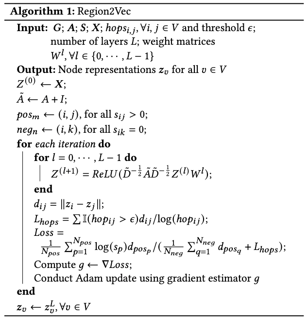

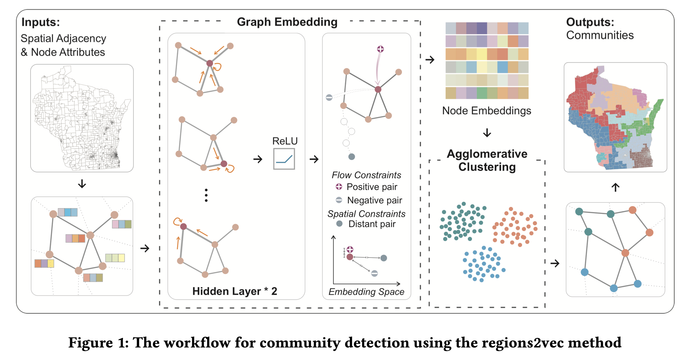


## 4. Baseline
- Louvain algorithm
	- 휴리스틱 modularity optimization.
	- Flow connections 데이터만 사용
- DeepWalk: Random walk based model 1
- Node2Vec: Random walk based model 2
	- GCN 대신 사용. clustering stage는 동일하게 진행
	- spatial adj. maxtrix만 사용
- LINE: Large-scale Information Network Embedding
	- spatial adj. matrix만 사용
- K-Means
	- graph structrue 없이 학습되지 않은 node feature만 입력해서 사용


> [!NOTE]
> 모델마다 제공받는 데이터가 달라 공정한 비교가 어려움


### 4.1. Evaluation
- Intra/Inter Flow Ratio
	- spatial interaction flow ratio
$$
\text { Intra/Inter Flow Ratio }=\frac{\sum_{c_i=c_j} s_{i j}}{\sum_{c_i \neq c_j} s_{i j}} ; c_i, c_j \in 1,2, \cdots, K
$$
- Inequality
	- infrastructure inequality across multiple geographic regions
		- 1: max inequality
		- 0: min inequality
$$
I=\frac{\sigma}{\sqrt{\mu(1-\mu)}} ; 0<\mu<1
$$
- Similarity Metrics
	- cosine similarity (L2-norm dot product)
- Homogeneity Scores
	- socio-economic characteristics
		- percentage of the population with income at or lower than 200% federal poverty level


## 5. Results

- Intra-inter flow ratio
	- Louvain is the best
	- Region2Vec is second
- Inequality
	- K-Means is the best*
	- Region2Vec is second
- Consine Similarity
	- K-Means is the best*
	- Region2Vec is second
- Homogeneity
	- K-Means is the best*
	- Region2Vec is second

K-Means는 원래 inequality 최소화와 similarity 최대화를 위한 알고리즘 이다. Intra-inter flow ratio를 보면 spatial information을 이용해 적절한 클러스터를 만들지 못했음을 볼 수 있다.

Louvain은 modularity score를 고려해서 greedy 하게 local optimization 하는 알고리즘이기 때문에 Intra-inter flow ratio 수치에서 유리하다.


## 6. Conclusion
- GCN 을 사용해서
	- spatial adj.
	- spatial interaction flow
	- node attributes
- 를 고려한 clustering method를 만들 수 있었음


> [!NOTE] 
> Node embedding의 차원을 어떻게 결정했는지 논문에 나오지 않는다. 차원이 높으면 $d_{ij}$의 변별력이 없어질 수 있어서 중요한 변수로 생각. 기본값은 14.


> [!NOTE] GNN으로 community detection
> - Loss 조정해 GNN 학습/임베딩 후 ML clustering
> - Class의 prob. distribution을 학습시킴
> - Modularity를 직접 예측

# Supervised, Unsupervised, Self-supervised
지도학습, 비지도학습, 자가지도학습의 차이는 무엇일까?

인공지능 분야를 처음 공부하면, 다음과 같은 정의에 익숙할 것이다.
- 지도학습: 분명한 라벨과 에러(또는 리워드)를 따라서 학습
- 비지도학습: 분명한 라벨과 에러 없이 학습
- 자가지도학습: 지도학습과 비지도학습의 중간 정도의 방법.

이러한 정의는 아주 당연한 의문을 불러일으킨다. 일반적인 순전파신경망(feed-forward neural network)에서 역전파 알고리즘은 에러를 weight로 편미분한 값을 출력층부터 입력층까지 전달해 weight 업데이트, 곧 학습을 진행한다. 그런데 label이 없다면 무엇을 기준으로 error를 만들고 BP를 진행해서 weight를 업데이트하고 학습을 달성할수 있다는걸까?


# 지도는 어디에서 일어나는가
지도학습의 지도는 출력된 label과 실제 label의 차이에서 시작된다. 이는 다시 말해서, label이 데이터와 함께 주어졌다는 것이다. 여기에 맞춰서 정의를 좀 더 업데이트해 보자.
- 지도학습: 입력과 올바른 출력의 쌍, 다르게 말해서 데이터와 label의 조합이 주어진 상태로 학습.
- 비지도학습: 입력에서 올바른 label이 주어지지 않았음
- 자가지도학습: label을 스스로 생성함

실제로 여러 자가지도학습 알고리즘을 살펴보면 어떤 형태로든 입력값과 중간층의 출력에 대한 label을 형성하는 것을 볼 수 있다. 주어진 데이터셋을 통해서 지도학습과 비지도/자가지도 학습을 구분하는 이 접근은 조금 더 타당해보인다.

결국 지도학습 기계가 학습하고자 하는 것은 결국 data가 주어졌을때 label의 확률분포다.
$$
\text{supervised-model} \sim  P(label \mid data)
$$


# Unsupervised vs. Self-supervised
비지도 vs. 자가지도

Yann Lecun과 다른 AI연구자들이 언급하거나 본인들의 논문에서 묘사하는 것을 보면, 어느날부터 비지도학습을 자가지도학습이라고 고쳐 부르고 있는 모습을 볼 수 있다. 이제 혼동을 피하기 위해서 비지도학습이 아니라 자가지도학습이라고 부르겠다.


## What makes label in self-supervised learning?
자가지도학습에서 라벨은 어디서 기인하는가?

자가지도학습은 입력된 data의 representation을 어떤 식으로든 생성한다. 이 representation을 일종의 label로 볼 수 있다. 자가지도학습도 지도학습과 비슷하게, 데이터로부터 라벨을 형성한다 $\sim P(label \mid data)$. 다만 라벨이 dataset에t 주어지지 않기 때문에 라벨을 스스로 생성해야한다. 대부분의 현대적 자가지도학습 모델은 라벨의 분포가 data의 분포와 유사하도록 학습한다.
$$
\text{self-supervised-model} \sim  P(label \mid data), P(label) \sim P(data)
$$

But how??

자연스럽게, $\text{self-supervised-model}: data \rightarrow label$ 의 함수로 사용할 수 있기 때문에 self-supervised learning을 pre-train 과정에서 사용할 수 있다.


# Discussion
self-supervised learning은 미묘하게 시간이나 정보의 위계에 대한 묘사를 포함하고 있는 것으로 보인다. 최초의 train/inference 과정에서도 error/reward를 얻어낼 수 있는 지도학습 알고리즘과 달리, self-supervised learning 과정에서는 시간에 따라 계속해서 입력되는 데이터를 stochastic하게 inference해서, higher hierarchy에 있는 data structure를 모델에 학습시키는 과정이기도 하기 때문이다.


자가지도학습이 데이터의 분포를 학습하기 때문에, 데이터 분포에 대한 self-supervised-error의 공간을 상상할 수 있다. 이 공간에서 error를 energy로 보면, self-supervised learning 과정을 energy optimization 과정으로도 볼 수 있다.


# References
- https://www.reddit.com/r/MachineLearning/comments/q0cex6/d_help_me_understand_selfsupervised_learning/
- https://www.facebook.com/yann.lecun/posts/10155934004262143