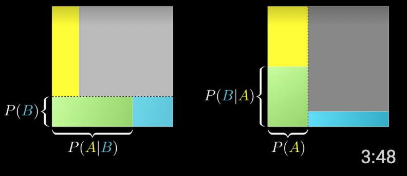
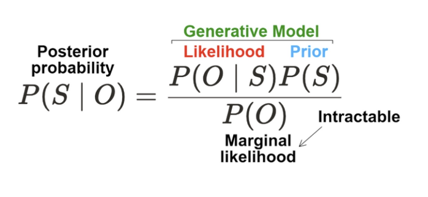

# 베이지안 통계학
Bayesian statistics

베이지안 통계학은 베이즈 정리에 따라 사전확률과 사후확률의 관계로 통계적 추론을 수행하는 방법이다.

## 베이즈 정리
둘 이상의 사건에 대한 사전확률과 사후확률간의 관계에 대한 정리
$$\text{posterior} = \frac{\text{likelihood} \times \text{prior}}{\text{evidence}}$$
사후확률은 가능도(=우도)와 사전확률의 곱을 증거확률로 나눈 값이다. 실제 문제에서 ‘증거확률과 우도’와 ‘사전확률’을 동시에 알기 어렵다는 한계가 있었다. 빅데이터와 컴퓨터 기술의 발달로 사건의 확률을 근사할 수 있게 되면서 활용도가 커지고 있다. 특히 후술하는 Sequential optimization 문제를 풀기 위한 배경 이론으로써 베이지안 최적화에 사용된다.

베이즈 정리를 두 사건에 대해 수식으로 표현하면 아래와 같다. 두 사건에 대한 식이 가장 많이 쓰인다.
$$
P(B|A) = \frac{P(A|B) \times P(B)}{P(A)}
$$

베이즈 정리를 $n$개의사건에 대해 수학적으로 일반화 할 수 있다. 표본공간 $S$를 사건들 $A_1, A_2, ... , A_n$이 분할할 때, 사건 $B \neq \emptyset$ 에 대한 $P(B)$는 $P(B)= \sum_{i}^n P(B\cap A_i)$다(확률의 덧셈정리). 이는 다시 $P(B)= \sum_{i}^n P(A_i)P(B|A_i)$와 같다(확률의 곱셈정리). 이런 상황에서 사건 $B$가 일어나는 것을 전제로 한 사건 $A_i$ 의 조건부 확률은 다음과 같이 구할 수 있다.
$$\displaystyle P(A_i|B)={P(B\cap A_i)\over P(B)}={P(A_i)P(B|A_i)\over {\sum_{i}^n P(A_i)P(B|A_i)}}$$
또는 $P(B) = \sum_{i}^n P(A_i)P(B|A_i)$를 $\int_{A} P(B|A)$로 적을 수 있다.

### 예시
병에 걸린 사람을 A확률로 찾아내는 검사키트가 있다. 양성판정을 받은 사람이 실제로 병에 걸렸을 확률X는? (이때 사람이 이 병에 걸릴 확률은 B다.)

#### 비유적 요약
전체 사람들 중 병에 걸린 사람이 충분히 적다면 양성 환자가 유병일 확률도 작을 수 밖에 없다. 왜냐하면 병에 걸리지 않은 사람이 너무 많아서, 양성 환자 중에서 무병양성(오진) 환자가 유병양성 환자의 수를 압도하기 때문이다. 이 때에는 오진률을 낮추는 것이 양성환자의 유병률을 높이는데 도움이 된다.

#### 수학적 해설
$$P(B|A) = \frac{P(A|B) \times P(B)}{P(A)}$$
- $A$
	= 유병인 사람이 양성일 확률
	= (유병 → 양성) 확률
	= $P(A|B)$
	= 우도 likelihood $\mathcal{L}$
- $B$
	= 어떤 사람이 유병일 확률
	= (사람 → 유병) 확률
	$=P(B)$
	= 사전확률 prior
- 양성인 사람이 유병일 확률
	= (양성 → 유병) 확률
	= $P(B|A)$
	= 사후확률 posterior
- 어떤 사람이 양성일 확률
	= (사람 → 양성) 확률
	= $P(A)$
	= 증거확률 evidence
	= 어떤 사람이 유병이면서 양성일 확률
		+ 어떤 사람이 무병이면서 양성일 확률
	= (유병 → 양성) 확률
		+ (무병 → 양성) 확률 (오진률)

## 기하적 표현
베이즈 정리를 직관적으로 이해할 수 있도록 기하학적으로 표현할 수도 있다. 전체에서 $A$와 $B$의 면적은 서로 수직한 각각의 확률분포에 의해 결정되고, 면적 1의 정사각형 위에 네 개의 확률영역을 형성할 뿐이다.

### 참고 영상
<iframe width="100%" height="100%" src="https://www.youtube.com/embed/U_85TaXbeIo" title="YouTube video player" frameborder="0" allow="accelerometer; autoplay; clipboard-write; encrypted-media; gyroscope; picture-in-picture" allowfullscreen></iframe>
<iframe width="100%" height="100%" src="https://www.youtube.com/embed/HZGCoVF3YvM" title="YouTube video player" frameborder="0" allow="accelerometer; autoplay; clipboard-write; encrypted-media; gyroscope; picture-in-picture" allowfullscreen></iframe>

## Sequential Optimization 관점
Sequential optimization 관점에서, 베이즈 정리는 현재까지의 증거를 바탕으로 다른 사건의 확률을 통계적 추론하는 과정으로 볼 수 있다. 임의의 가정, **prior** $P(B)$에 새로운 사건 $A$를 반영해서 조건부 확률이자 사후확률인 $P(B|A)$를 구하는 것이다.

다음과 같은 Machine learning 알고리즘에서 베이즈 정리가 사용된다.
- Naive Bayesian
- 베이지안 최적화
- Kriging

### 예시
1. 어떤 사람이 유병인지 진단받으러 왔다.
2. 이 사람의 유병률은 $P(B)$다.
3. 그런데 이 사람이 양성판정을 받는 사건 $A$가 일어났다.
4. 이때 이 사람의 유병률은, 사건 $A$에 따라 업데이트된 $P(B|A)$다.
5. 이는 베이즈 정리에 따라 구할 수 있다.

## 고전통계와의 비교
$$Classical Statistics: P(data|model)$$
$$Bayesian Statistics: P(model|data)$$
베이지안 통계학은 추론통계의 두 학파 중 하나다. 추론통계가 미지의 확률에 대해 모집단의 P-value를 통한 검정을 추구하는데 반해, 베이지안 통계학은 사건 발생에 따른 사후확률의 업데이트로 미지의 확률을 구하고자 한다. 곧, 고전 통계학은 과거의 결과에 따라 통계적 가설의 타당성을 검증한다. 베이지안 통계학은 모델의 가능성을 과거의 결과에 따라 계산하여 검정한다.

## 머신러닝 관점
Machine learning 을 문제와 답을 입력으로 받고 해결책을 출력하는 과정으로 일반화한다면, 베이지안통계학의 $P(model|data)$과 연결되는 부분이 있다.

## Bayesian brain: 인지과학, 신경과학 관점
인간의 인지와 심리 또는 신경의 행동이 베이즈 정리에 부합함을 보이는 연구가 있다. 
- https://kilthub.cmu.edu/articles/journal_contribution/Bayesian_models_of_cognition/6613682
- https://www.psy.gla.ac.uk/~martinl/Assets/MCMPS/KnillPouget04.pdf

이 필드에서는 특히 O, observation으로 notation 하는게 특징이다.

$P(O)$ 는 $p(\mathbf{X} \mid \alpha)=\int_\theta p(\mathbf{X} \mid \theta) p(\theta \mid \alpha) \mathrm{d} \theta$  에 따라서 계산된다. 식의 상징적인 의미는 모든 가능한 경우에 대한 likelihood, 곧 [marginal likelihood](https://en.wikipedia.org/wiki/Marginal_likelihood)다.

### 크롬웰의 법칙 Cromwell's Rule; The zero priors paradox
사전확률 prior를 0 또는 1로 두게 되면, 베이즈 정리에 따라 사후확률도 항상 0이나 1이 된다. 따라서 새로운 증거가 나타나더라도 가설이 업데이트되지 못한다.

## Reference
1. “What is Bayesian statistics?”, NATURE BIOTECHNOLOGY, Vol. 22, No. 9, pp. 1177-1178, 2004
2. “Bayes’ theorem”, NATURE METHODS, Vol. 12, No. 4, pp. 277-278, 2015
3. “Bayesian statistics”, NATURE METHODS, Vol. 12, No. 5, pp. 377-378, 2015
