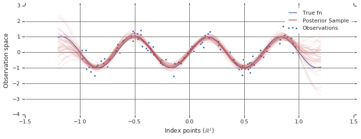

# Gaussian process
가우시안 프로세스

# Gaussian process 이론
가우시안 프로세스는 입력 값과 출력 값 분포의 gaussian한 무작위성을 고려한 확률분포 생성 프로세스다. 확률론의 배경이 있기 때문에 이를 확률분포 생성 모델로 보지만, Machine learning 측면에서 이를 Regression모델로 볼 수 도 있다.

 

## 설명
다변량 정규분포는 아래와 같이 쓸 수 있다. 평균 $\mu$의 벡터와 분산 $\Sigma$의 행렬로 표현한 것이다.

$$p(x, y) \sim \mathcal{N}\left(\left[\begin{array}{l}\mu_x \\ \mu_y\end{array}\right],\left[\begin{array}{c}\Sigma_x \Sigma_{x y} \\ \Sigma_{x y}^T \Sigma_y\end{array}\right]\right)$$

가우시안 프로세스는 mean function $m(t)$와 커널-covariance matrix를 생성하기 위한-의 조합으로 표현할 수 있다.

# 구현

# References
- https://greeksharifa.github.io/bayesian_statistics/2020/07/12/Gaussian-Process/
- https://github.com/ShuaiGuo16/Gaussian-Process/blob/master/GP_cheatsheet.pdf