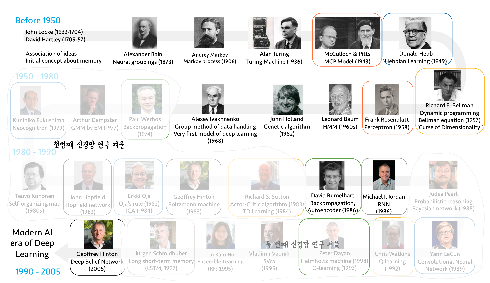
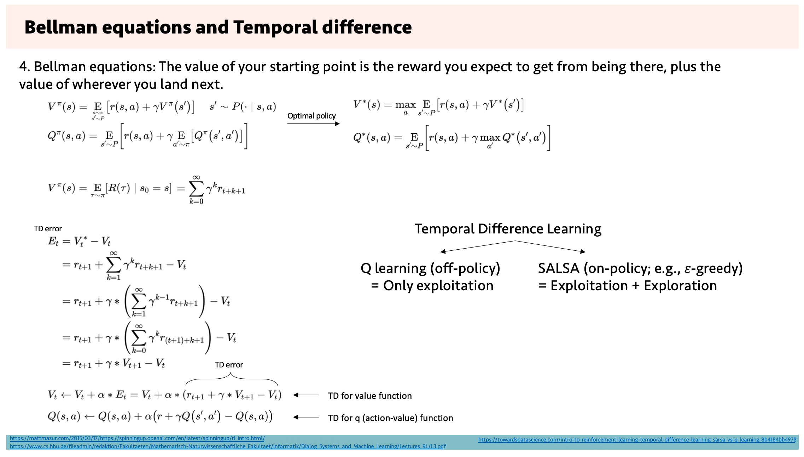

# 근대 인공지능의 역사
History of modern
현대 인공지능 모델이 나타나기까지 인공지능 연구의 역사에서 다뤄왔던 모델들을 주제와 시간에 따라 다뤄보자.

# 주제별 역사

- 같은 주제의식을 공유하는 연구는 같은 색 테두리로 표현되어 있다.
- 첫 번째 겨울
	러닝 알고리즘의 부족. 신경망에 적절한 가중치를 부여하기 어려웠다.
- 두 번째 겨울
	하드웨어 계산속도의 부족. 필요한 가중치 계산을 충분한 시간 내에 하기 어려웠다.
주제: 신경과학 도메인에서의 시각

## 신경모델
- MCP Model (McCulloch & Pitts, 1943)
- Perceptron (Frank Rosenblatt, 1958)

## Plasticity
- Hebbian learning (Donald Hebb, 1949)
- Oja's rule (Erkki Oja, 1984)

## 강화학습: action
강화학습을 이용한 접근방식
- Dynamic programming (Richard E. Bellman, 1957)
	- Bellman equation
		- 차원의 저주
- Actor-critic algorithm (Richard S. Sutton, 1983)
	- TD learning (1984)
- Q learning (Chris Watkins, 1992)

## 생성모델: internal representation
- Back propagation (Paul Werbos, 1974)
- Back propagation, Autoencoder (David Rumelhart, Geoffrey Hinton, 1986)
- Helmholtz machine (Peter Dayan, 1998)
	- Q-Learning (1993)

## 시각체계
- Neocognitron (Kunihiko Fukushima, 1979)
- Convolutional Neural Network (Yann LeCun, 1989)

## 비-순전파 신경망: cognition 
Feed forward(순전파)하지 않는 신경망
- Hopfield network (John Hopfield, 1982)
- Boltzmann machine (Geoffrey Hinton, 1983)
- Deep Belief Network (Geoffrey Hinton, 2005)

## 순차적 데이터: temporal domain
Sequential Data에 대해 다루는 인공지능 분야
- Recurrent neural network (Michael I, Jodan, 1986)
- Long short-term memory (Jürgen Schmidhuber, 1997)

# 시간순 역사
- 시간 순서로 주요 연구를 아래 정리하였다.

## 극초기
- Initial concept of memory (John Locke, 1632-1704) (David Hartley, 1705-1757)
- Neural groupings (Alexander Bain, 1873)
- Markov process (Andrey Markov, 1906)
- Turing Machine, Turing test (Alan Turing, 1936)

## 1943 | MCP Model
(McCulloch & Pitts, 1943) 신경 모델을 전자적으로 구현.
퍼셉트론 문서에서 더 자세히 설명.

## 1949 | Hebbian learning
(Donald Hebb, 1949) Learning algorithm을 제시하고, 신경망을 학습시킴.
인공신경망 학습 알고리즘 문서에서 더 자세히 설명

## 1958 | Perceptron의 등장
(Frank Rosenblatt, 1958) 퍼셉트론 문서에서 또한 자세하게 설명. 역사적 의의 중 하나는 인공지능 모델과 달리 Sigmoid 함수를 이용해서 step function 보다 나은 Nonlinearity를 추가했다는 점이다.

## 1962 | Genetic algorithm
(John Holland, 1962) 유전 알고리즘으로 최적 전략을 찾아내는 연구. 신경망을 사용하지 않는 접근이다.
Genetic algorithm

## 1968 | Group method of data handling
(Alexey Ivakhnenko, 1968) Deep learning과 유사한 최초의 시도.
$$Y(x_{1}, \dots , x_{n}) = a_{0} + \sum\limits_{i=1}^{m}a_{i}f_{i}$$
$$
\begin{align}
Y\left(x_1, \ldots, x_n\right)=
&\begin{aligned}
a_{0}
\end{aligned} \\
&\begin{aligned}
+\sum_{i=1}^{n} a_i x_i
\end{aligned} \\
&\begin{aligned}
+\sum_{i=1}^n \sum_{j=i}^n a_{i j} x_i x_j
\end{aligned} \\
&\begin{aligned}
+\sum_{i=1}^n \sum_{j=i}^n \sum_{k=j}^n a_{i j k} x_i x_j x_k+\cdots
\end{aligned}
\end{align}
$$
- Output $Y$를 elementary function $f_{i}$의 가중합으로 표현
- Elementary function은 input variable의 모든 가능한 선형곱의 가중합

## 첫 번째 겨울
다음에 나오는 backpropagation이 연구되기 전까지, 학습(가중치 업데이트) 알고리즘의 부재로 인한 첫 번째 인공지능 연구의 겨울이 있었다.

## 1974 | Backpropagation
(Paul Werbos, 1974) Back propagation 항목에서 설명. Werbos는 박사학위논문에서 dynamic feedback 이라는 이름으로 BP 개념을 제시한 바 있다. Geoffrey Hinton이 BP 개념을 만든 것으로 널리 알려져 있기 때문에 [논쟁](https://www.reddit.com/r/MachineLearning/comments/g5ali0/d_schmidhuber_critique_of_honda_prize_for_dr/)이 있다. 

## 1979| Neocognitron
(Fukushima, 1979) 신경과학 관점에서는 영장류 시각체계 초기 모델. 후에 Convolutional Neural Network가 LeCun에 의해서 제시될 때, Fukushima의 연구를 알고 있지는 않았다. 하지만 MLP를 이용한 feature extraction의 개념은 이 때 이미 제시되어 있었다.

## 1982 | Hopfield network
(John Hopfield, 1982)
Hopfield network 문서에서 더 자세한 내용을 소개하고 있다.

## 1983 | Boltzmann machine
(Geoffrey Hinton, 1983) Hopfield network와 같은 Energy minimization 관점을 공유함.
Boltzmann machine

## 1983 | Actor-critic algorithm
(Richard S. Sutton, 1983) 강화학습의 본격적인 시작. 강화학습의 기초가 되는 수식과 프로세스다. 다음의 프로세스에서 reward는 environment와 return 시점에 의존한다(=내재적 uncertainty). 언제 reward가 주어질지, reward를 높이는 방향으로 policy를 업데이트한다는 것은 어떤 의미인지를 알기 어렵기 때문에 RL을 이용해 현실의 문제를 풀기 어려워지는 문제가 있다.
 1. Cycle:
	 1. State
	 2. Action
	 3. Reward (Return, Value, Q-function으로 개념이 고도화됨)
		 1. Policy update

## 1984 | 강화학습: TD learning
Bellman Equation

- Neuro Science 분야에서 reward에 대해서 다룰때 TD-error에 대한 개념을 많이 다룬다.
- 이후 저서: Reinforcement Learning. An introduction
- Q-learning
- Optimal Control Theory

## 1986 | Auto Encoder
(David Rumelhart, 1986)
- Internal representation(≈ encoding)

**AutoEncoder는 Generative 모델인가?**
Deterministic encoder기 때문에, 오토인코더는 당연히 input과 유사한 output을 생성한다. 때문에 (사람이 인식하기에) 새로운 데이터를 생성할 수 있는 generative 모델이라 불릴 수 있는 수준을 달성하지는 못했다. 하지만 후에 Deep belief network(Hinton G, 2006)을 보면 DBN을 확률론적 autoencoder 로써 묘사하고 있다. 따라서 generative 모델의 초기 시도로 볼 수 있겠다. Generative model 분야에서는 후에 variational autoencoder 또한 등장하는데, 이 모델 또한 확률분포를 이용해 생성모델을 구현하고 있다.
그렇지만, DBN류의 확률분포를 이용하는 생성모델이 널리 사용되고 있지 못한데, 학습이 잘 안 되기 때문이다. 학습이 잘 안되는 이유는 확률론적 모델로써 sampling layer가 필수적인데, 이 sampling 과정이 computationally heavy하기 쉽기 때문이다.

**신경과학 관점에서 ==Helmhotlz machine==과의 비교**
Autoencoder를 절반으로 접어놓은 것과 같은 형태. encoder와 decoder가 같은 weight를 공유한다고 볼 수도 있겠다. 홍석준 교수님께서 말씀하시기로는, 감각을 인코딩하고, 예상을 디코딩하는 형태로 뇌에 구현되어있지 않을까 생각하게 된다는데, 왜냐하면 같은 weight를 공유하는 형태가 connection 관점에서는 encoding 방향과 decoding 방향 양쪽 모두로 connection이 있는 형태기 때문이다. 이는 신경과학 관점에서 predictive coding이라 불리는 개념이다.

## 1986 | Recurrent neural network
(Michael I. Jordan, 1986)
Recurrent neural network

## 1988 | Probabilistic reasoning과 Bayesian network
(Judea Pearl, 1988)

## 1989 | Convolutional neural network
(Yahn LeCun, 1989)
Convolutional Neural Network

**Neocognitron과의 차이점**
Neocognitron은 잘 동작하는 시각모델의 시초로써, WTA(Winner Takes it All)이라는 자체적인 알고리즘을 학습과정에서 사용하였다. 이 알고리즘을 통해 Neocognitron은 unsupervised learning과 일면 유사성 있는 학습을 할 수 있었지만, 잘 학습되지는 않았다. 이후 CNN이 학습성능과 사용성능 모두 좋은 모습을 보여주면서 CNN이 시각모델의 기초로 여겨지고 있다.

## 두 번째 겨울
컴퓨팅 파워의 부족으로 인한 신경망 연구의 겨울 시기 동안 shallow level의 알고리즘들이 많이 연구되었다.
- Q-learning (Peter Dayan, 1993)
- Support vector machine (Vladimir Vapnik, 1995)
- Extream gradient boosting
이후 DBN이 나오면서 현대적 NN모델과 연구들이 등장하게 된다.

# References
- https://www.youtube.com/embed/RBx0s-uqEh0
- https://www.youtube.com/embed/OMbg87Xyf2U
