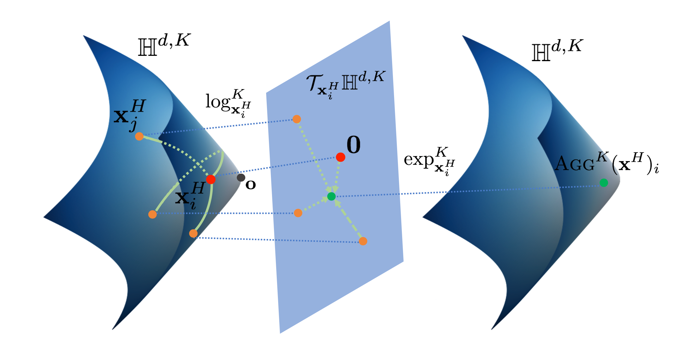
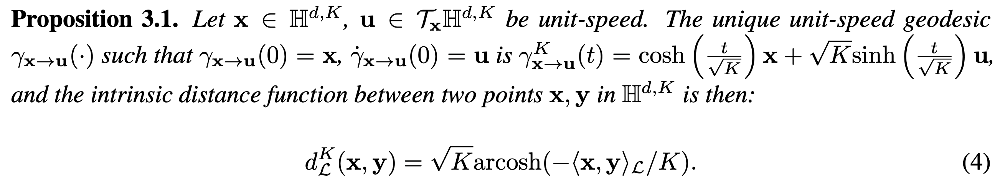
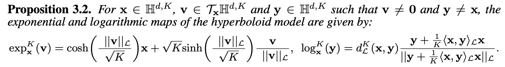
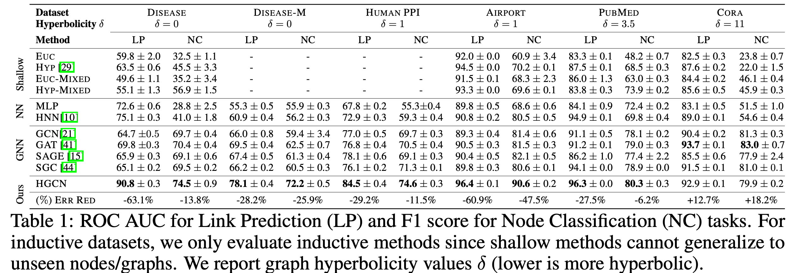
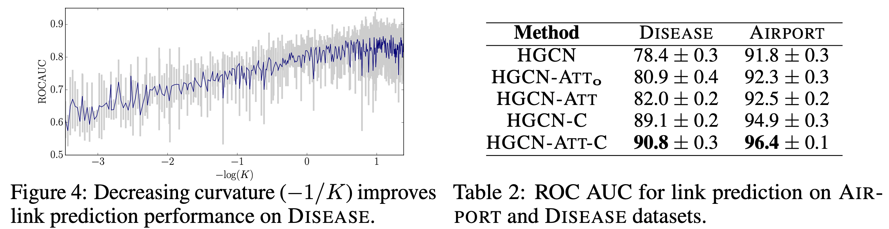

# Hyperbolic GCNN
Hyperbolic Graph Convolutional Neural Networks
- NeurIPS 2019
- 302 Citations in Google Scholar
- 저자
  - Stanford University
  - cs224w 강의를 진행하는 등 network 관련 연구실

## Overview
쌍곡면을 커널로 사용하는 Graph neural network.

노드들의 feature vector를 쌍곡면 위에 플롯한다. 쌍곡면과 한 점에서 접하는 평면-하이퍼볼릭탄젠트 공간-위에 플롯된 feature 벡터들을 사영한다. 이를 통해 가까운 노드들의 feature 분포를 확대하고 먼 노드들의 feature 분포를 축소하는 효과를 낼 수 있다. 게다가 하이퍼볼릭탄젠트 평면은 평면이기 때문에 feature aggregation을 위한 algebraic operation들이 정의되고 수행될 수 있다. 하이퍼볼릭탄젠트 공간에서 node feature aggregation 결과로 생성된 node feature를 다시 하이퍼볼릭 공간에 사영한다. 여기서 proposition을 통해 하이퍼볼릭 탄젠트 공간과 하이퍼볼릭 공간이 작은 범위에서 정보손실 없이 사영될 수 있음을 확인한다. 이는 결과적으로 하이퍼볼릭 공간 위에서 featrue aggregation을 수행한 것과 같은 결과를 내고자 함이다. 추가로, hyperbolic space ↔︎ hyperbolic tangent space의 계산은 hyperbolic trigonometric function의 일종이자, exporential & logaric function으로 표현될 수 있기 때문에 미분특성이 좋다.

- $\mathbb{H}^{d, K}$
	왼쪽과 오른쪽의 쌍곡면. $d$차원의 쌍곡면 공간
- $\mathcal{T}_{\mathbf{x}} \mathbb{H}^{d, K}$
	평면. $d$차원의 하이퍼볼릭 탄젠트 공간
- $\textrm x_j^H$
	주황 점. feature vector of a node
- $0$
	빨간 점. 왜곡이 최소가 되는 탄젠트 공간과 하이퍼볼릭 공간의 접점
- $\operatorname{AGG}^{K}(\mathbf{x}^{H})_{i}$
	초록 점. aggregation된 feature vector
- $\log$와 $\exp$
	hyperbolic space ↔︎ hyperbolic tangent space 간의 전환을 수행하는 커널 함수

### Problem setting
유클리디언 공간 $\rm E$(↔︎ 하이퍼볼릭 공간 $\rm H$)에 있는 $d$ 차원의 노드 특성이 $0$ 번째 레이어에 입력으로 들어갈 때, 아래와 같이 표현할 수 있다.

$$(\rm x^{0,E} \it \_i )_{i \in \mathcal{V}}$$
$$f:\left(\mathcal{V}, \mathcal{E},\left(\mathbf{x}_{i}^{0, E}\right)_{i \in \mathcal{V}} \right) \rightarrow Z \in \mathbb{R}^{|\mathcal{V}| \times d^{\prime}}$$

본 논문에서는 Graph neural network를 개선시키기 위해 더 나은 임베딩함수 $f$를 만든다. 임베딩함수는 노드, 에지, 이웃한 노드의 feature vector $\left(\mathcal{V}, \mathcal{E},\left(\mathbf{x}_{i}^{0, E}\right)_{i \in \mathcal{V}} \right)$를 feature vector의 집합 $Z$로 변환한다. 모든 feature vector가 이웃한 노드의 모든 feature vector를 가지고 있다면, $Z$의 차원은 feature vectore의 차원이 $d$일때 $|\mathcal{V}| \times d$ 차원이다. 임베딩 함수 $f$의 목적은 $|\mathcal{V}| \times d$보다 작은 $|\mathcal{V}| \times d^{\prime}$ 차원에 feature vector를 임베딩하는 것이다.

## Background

### GCNN과 비교
Graph Convolutional Neural Network에서는 feature representation $h$를 $h=W \rm x + b$ 꼴의 linear transform의 연속으로 생성한다. 이후 neighborhood aggregation(convolution analogy)를 통해 feature vector $\mathbf{x}_i^{\ell, E}$ 를 생성한다.

- Feature transform
$$
\mathbf{h}_{i}^{\ell, E}=W^{\ell} \mathbf{x}
_i^{\ell-1, E}+\mathbf{b}^{\ell}
$$
- Neighborhood aggregation
$$
\mathbf{x}_i^{\ell, E}=\sigma\left(\mathbf{h}_i^{\ell, E}+\sum_{j \in \mathcal{N}(i)} w_{i j} \mathbf{h}_{j}^{\ell, E}\right)
$$

### 기하 관점
Hyperbolic geometry is a non-Euclidean geometry with a constant negative curvature $c$. Here, we work with the hyperboloid model for its simplicity and its numerical stability.
- 원
	$x^2 + y^2 = r^2$
- 쌍곡선
	$-x^2+y^2 = c$

### Hyperbolic 이면
$$
\mathbb{H}^{d, K}:=\left\{\mathbf{x} \in \mathbb{R}^{d+1}:\langle\mathbf{x}, \mathbf{x}\rangle_{\mathcal{L}}=-K, x_{0}>0\right\} \quad
$$
$$
\mathcal{T}_{\mathbf{x}} \mathbb{H}^{d, K}:=\left\{\mathbf{v} \in \mathbb{R}^{d+1}:\langle\mathbf{v},\mathbf{x}\rangle_{\mathcal{L}}=0\right\}
$$
- $\mathbb{H}^{d, K}$ has negative curvature $-1/K$
    - Minkowski inner product
		$<\mathbf{x}, \mathbf{y}>_\mathcal{L} := -x_0y_0 + x_1y_1 + \dots + x_dy_d$
		dot product의 변형으로, 음의 곡률을 만들기 위해 한 가지 축 방향으로 음의 dot product 항이 있다.
- Euclidean tangent space at point $\rm x$
	- tangent space ≡ set of orthogonal vectors
- $\rm v, w$는 아래 식을 만족하는 리만 메트릭 텐서 $\in$  리만 곡면
$$
\mathcal{T}_{\mathbf{x}} \mathbb{H}^{d, K}, g_{\mathbf{x}}^{K}(\mathbf{v}, 
\mathbf{w}):=\langle\mathbf{v}, 
\mathbf{w}\rangle_{\mathcal{L}}
$$

- 리만곡면은 국소적으로 복소평면과 동형
	- 따라서 국소적으로는 Euclidean 연산 가능
		⇒ 전체 공간에서는 유클리드 연산이 정의되지 않기 때문에 유용

### Geodesics and induced distances

- 첫 번째 그림
	Tangent space 를 2차원에 사영하면 Poincaré disk와 같다
- 두 번째 그림
	곡률이 커지면 두 점 사이의 거리가 늘어난다
- 세 번째 그림
    - 회색 선 hyperbolic parallel lines…

이 그림과 유클리드 평면을 생각하면서,
- Geodesics and distance functions are particularly important in graph embedding algorithms, as a common optimization objective is to minimize geodesic distances between connected nodes.

### Proposition

- 하이퍼볼릭 공간 H위의 한 점 x
- x를 포함하는 탄젠트 공간 TH 위의 한 벡터 u를 unit-speed  라고 하자
- unique unit-speed 를 가지는 geodesic 𝛾 가 있다
    - 𝛾는 x가 원점
    - 𝛾는 t에 대한 𝛾 위의 한 벡터의 미분이 u다
- 이때 𝛾 는 선형 t 공간을 K에 의존하는 cosh, sinh로 변형한 공간이다
- 따라서 H 위의 두 점의 거리는 K에 의존하는 arccosh(TH norm)의 식으로 나타낼 수 있다
    - $\mathcal L$은 TH위의 노름을 의미

### 이 수식의 의미는,
TH를 잘 정의하면, H의 거리를 쉽게 구할 수 있다 (특히, 미분이 쉬운 형태로)
	⇒ 일종의 커널

### Exporential and logarithmic maps
H와 TH 사이의 매핑을 위한 추가 커널.
- $\rm exp^K_x(v) := \gamma(1)$을 이용
- In general Riemannian manifolds, these operations are only defined locally but in the hyperbolic space, they form a bijection between the hyperbolic space and the tangent space at a point.
    - 구면에서는 원을 돌아 오면 계속 같은 점이 반복되지만, 쌍곡면에서는 그렇지 않은 성질을 이용

결과적으로는 아래 수식을 얻을 수 있다.

## Method
1. Mapping from Euclidean to hyperbolic spaces
	Hyperbolic distance 이용
	$\mathbf{x}^{0, H}=\exp _{\mathbf{o}}^{K}\left(\left(0, \mathbf{x}^{0, E}\right)\right)=\left(\sqrt{K} \cosh \left(\frac{\left\|\mathbf{x}^{0, E}\right\|_{2}}{\sqrt{K}}\right), \sqrt{K} \sinh \left(\frac{\left\|\mathbf{x}^{0, E}\right\|_{2}}{\sqrt{K}}\right) \frac{\mathbf{x}^{0, E}}{\left\|\mathbf{x}^{0, E}\right\|_{2}}\right)$
2. Feature transform in hyperbolic space
    Hyperboloid linear transform 이용
	$W \otimes^{K} \mathbf{x}^{H}:=\exp_{\mathbf{o}}^{K}\left(W \log_{\mathbf{o}}^{K}\left(\mathbf{x}^{H}\right)\right)$
	$\mathbf{x}^{H} \oplus^{K} \mathbf{b}:=\exp_{\mathbf{x}^{\mathbf{H}}}^{K}\left(P_{\mathbf{o} \rightarrow \mathbf{x}^{H}}^{K}(\mathbf{b})\right)$
3. Neighborhood aggregation on the hyperboloid manifold  
	Attention based aggregation 이용
	$w_{i j}=\operatorname{SOFTMAX}_{j \in \mathcal{N}(i)}\left(\operatorname{MLP}\left(\log _{\mathbf{o}}^{K}\left(\mathbf{x}_{i}^{H}\right) \| \log _{\mathbf{o}}^{K}\left(\mathbf{x}_{j}^{H}\right)\right)\right)$
	$\operatorname{AGG}^{K}\left(\mathbf{x}^{H}\right)_{i}=\exp _{\mathbf{x}_{i}^{H}}^{K}\left(\sum_{j \in \mathcal{N}(i)} w_{i j} \log _{\mathbf{x}_{i}^{H}}^{K}\left(\mathbf{x}_{j}^{H}\right)\right)$
	- i, j 에 대해
	- log로 tangent space로 옮겨서 linear transform을 정당화하고
	- || 로 concat 하고
	- MLP로 임베딩하는 과정을
	- 모든 이웃에 대해 수행하고서
	- SOFTMAX 한다
	⇒ 결과로 나온 w를
		- exp 에 넣어서 다시 H위로 옮긴다

### Non-linear activation with different curvatures
$$\sigma^{\otimes^{K_{\ell-1}, K_{\ell}}}\left(\mathbf{x}^{H}\right)=\exp _{\mathbf{o}}^{K_{\ell}}\left(\sigma\left(\log _{\mathbf{o}}^{K_{\ell-1}}\left(\mathbf{x}^{H}\right)\right)\right)$$
- $K_l$ 로 적절한 K를 learnable
- 𝜎 로 non-linear
- log, exp 를 거치며 커널로 공간 변환

## Experiments
여러 데이터셋에 대해 아래 네 가지를 비교하였으며
- 보통 NN
- 주변만 보는 GNN
- 더 큰 주변을 Euclidean 하게 보는 GNN
- HGCN
	최적 $\rm K$ 를 찾기 위한 탐색도 진행하였다.

## Results
community structure 가 분명한 곳에서 기존보다 더 뛰어난 성능을 보여줌

## Conclusion
