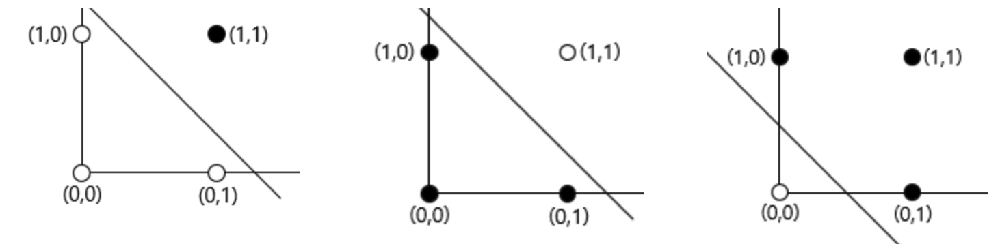

# Perceptron and MLP
퍼셉트론(Frank Rosenblatt, 1957)은 가장 초기 단계의 인공신경망 모델 중 하나다. 퍼셉트론은 Supervised learning을 통해 Binary classification 문제를 풀 수 있다.

# 퍼셉트론
우리가 인공지능을 통해 풀고 싶은 문제를 $n$개의 입력값을 보고 판단해 적절한 출력을 제시하는 문제로 일반화 해 보자. 입력 $\mathrm{x}_i$에 대해, 적절한 가중치 $\mathrm{w}_{i}$를 각각 곱해서 더해주면 우리가 원하는 출력 $\sum_{i}^{n}\mathrm{w}_{i}\mathrm{x}_{i}$을 만들 수 있을 것이다. 이는 단순한 가중합으로, 예를 들어 서류 20% 실기 80%으로 하여 실기에 4배 큰 $w_{i}$를 곱해 합한 점수로 선수를 선발하는 과정과 유사하다.

이 모델이 더 복잡한 문제를 풀 수 있도록 신경과학에서 밝혀진 신경의 구조를 응용하자. 신경은 들어온 입력의 크기가 충분한 크기에 도달할 때 까지는 반응하지 않다가, 어느 크기(역치)이상의 입력이 들어왔을 때만 출력을 내보낸다. 이 과정을 응용해 인공 뉴런을 만들어 보자.

역치 $\theta$ 이상의 입력 $\sum_{i}^{n}\mathrm{w}_{i}\mathrm{x}_{i}$이 주어졌을때 1, 아닐 때 0을 출력하는 계단 함수(step function)는 인공 뉴런의 행동을 잘 묘사한다. 계단함수는 가장 간단한 활성화 함수 중 하나다.
$$
y =
\begin{cases}
    1 & \text{if } \sum_{i}^{n}\mathrm{w}_{i}\mathrm{x}_{i} \geq \theta \\
    0              & \text{otherwise}
\end{cases}
$$

식을 간단하게 만들고 이후의 다른 딥러닝 문서에서 흔히 사용하는 꼴로 바꾼다 계단 함수 식에서 역치 $\theta$를 부호를 바꿔 편향 $\mathrm{b}$으로 표시하고, if-otherwise를 같은 과정을 수행하는 함수 $\sigma(x)$로 쓸 수 있다. 또한 $\sum_{i}^{n}\mathrm{w}_{i}\mathrm{x}_{i}$ 가중치벡터 $\mathrm{w}$의 전치 $\mathrm{w^T}$와 입력벡터 $\mathrm{x}$의 dot product로 표시한다. 아래 식에는 표시했지만, 때로는 Transpose전치를 의미하는 $T$를 생략하기도 한다.
$$
y = \mathrm{\sigma(w^{T}\cdot x+b)}
$$

이 퍼셉트론을 단층 퍼셉트론이라고 한다. $x$를 입력층 $y$를 출력층으로 부르는 한 층의 퍼셉트론이다.

## 학습 알고리즘
1. 가중치 초기화
2. $n$개의 데이터를 가진 Training set $D$에 포함된 입력과 적절한 출력의 순서쌍 $(\mathrm{x}_{j}, d_{j})$ 마다, $t$ 시점에서,
	1. 출력을 계산하고
		$y_{j, t} = \mathrm{w^{T}}_{j, t} \mathrm{x}_{j} + \mathrm{b}_{j, t}$
	2. 에러(= error = loss = cost)를 얻고
		$\delta = d_{j} - y_{j,t}$
	3. 가중치와 bias를 Optimization에 따라 업데이트한다. $\eta$는 학습률(learning rate)다. 아래 식에서는 $w$만 묘사하였다. bias 업데이트의 더 자세한 내용은 Back propagation 문서에서 볼 수 있다.
		$w_{i, t+1} = w_{i, t} + \eta \cdot \delta$

위 과정을 도식화하면 아래와 같다

# Multi-layer perceptron(MLP) 다층 퍼셉트론 
MLP는 단층 퍼셉트론을 여러 층 쌓은 인공신경망 모델이다. Feed forward neural network의 가장 단순한 형태로 볼 수 있다. 단층 퍼셉트론을 여러 층 쌓여있을때 입력층과 출력층 사이의 층을 은닉층(hidden layer)라 부른다. 이렇게 층이 많아졌을때의 인공신경망 모델을 Deep learning이라 부른다.

## 학습 알고리즘
MLP의 학습 알고리즘은 단층 퍼셉트론보다 조금 더 복잡하다. 역전파에서 이를 설명한다.

## 퍼셉트론과 논리 게이트
단층 퍼셉트론으로 논리 게이트 연산 중 AND, NAND, OR은 구현할 수 있다. 하지만 XOR 게이트를 구현하기 위해서는 다층 퍼셉트론이 필요하다. (사실 이는 XOR게이트를 AND, OR, NOT게이트의 조합으로 구현하는 것과 연결되는 부분이 있다.) XOR 게이트를 구현하기 위해서는 여러 층의 퍼셉트론을 쌓아야한다. 참고로 $\sigma$가 $\theta=0$인 계단함수일때, 각 논리게이트를 구현할 수 있는 퍼셉트론 가중치의 예시는 다음과 같다.

| GATE | $w_{1}$ | $w_{2}$ | $b$  |
| ---- | ------- | ------- | ---- |
| AND  | 0.5     | 0.5     | -0.9 |
| NAND | -0.5    | -0.5    | 0.9  |
| OR     | 1        | 1        | -0.1     |

### 기하적 직관: 선형 분리
논리 게이트를 구현하는 입력 두 개의 단층 퍼셉트론을 $(x_{1},x_{2},y)$ 공간 위의 $w_{1}x_{1}+w_{2}x_{2}+b=0$ 평면으로 볼 수 있다. 이때 평면은 전체 공간을 두 공간으로 나눈다. 나눠진 두 평면은 각각 $\sigma$함수에 따라 $y =\begin{cases}1 \\0 \end{cases}$로 매핑되며 이것이 곧 논리 게이트의 기하적 표현이다. 이를 $(x_{1},x_{2})$평면 위에 나타내면 다음과 같다.
- AND, OR, NAND
	
- XOR
polynomial kernel 을 이용하면 퍼셉트론이 XOR 문제를 풀 수 있게 만들 수도 있다.

# 퍼셉트론, 그 이후: SVM
퍼셉트론은 다음 그림과 같은 두 결정경계와 그 사이의 무한하고 연속한 결정경계중에 최선의 경계를 찾을 수 없다-퍼셉트론에게는 그 모든 결정경계가 동등하다. 이 문제를 해결하기 위한 연구는 Support vector machine으로 이어진다.

# 당시 논문: MCP Model

Neuro Science 에서 Integrate-and-fire model(Lapicque L, 1907)을 수식과 모델로 만든 것과도 같다.
재 

### 신경과학 관점: Integrate-and-fire 모델
Integrate-and-fire 모델은 현대까지도 Leaky-integrate-and-fire 모델로 신경이 자극에 어떻게 반응하는지에 대한 유효한 설명으로 쓰이고 있다.
$$O=\left\{\begin{array}{l}
1, \sum_i w_i x_i \geq \theta \quad \mathrm{AND} \quad z_j=0, \forall j \\
0, \text { otherwise }
\end{array}\right.$$

# Reference
- McCulloch & Pitts, 1943
- https://wikidocs.net/24958
- https://en.m.wikipedia.org/wiki/Perceptron
- https://www.baeldung.com/cs/deep-learning-bias-backpropagation
- http://page.mi.fu-berlin.de/rojas/neural/chapter/K7.pdf